# Morai_Sim_team2

2026 국토부 KATRI 대학생 AI/SW 모빌리티 경진대회 **AI융합자율주행 부문**을 위한 Team Stier의 MORAI 기반 자율주행 프로젝트다.

이 문서는 이후 사람이나 AI가 설계·구현을 진행할 때 가장 먼저 확인해야 하는 **대회 규정 베이스라인**이다. 현재 단계에서는 대회의 목적, 시뮬레이터 제약, 채점 기준, 제공 파일에서 확인한 사실과 아키텍처 책임 경계를 정의한다. 승인된 세부 ROS 인터페이스와 노드 설계는 `ros_architecture_pkg`의 중앙 계약에서만 확정한다.

> 기준일: 2026-09-03
>
> 공식 규정: v1.1 (2026-08-28 개정)
>
> 중요: 대회 규정과 제공 파일은 변경될 수 있다. 충돌 시 최신 공식 규정과 운영측 안내가 이 문서보다 우선한다.

## 1. 프로젝트 목표

주어진 차량·센서·UDP 인터페이스만 사용하여 MORAI의 지정 경로와 미션을 순서대로 수행하고, 제한 시간 안에 안전하게 완주하는 자율주행 시스템을 구현한다.

최적화 목표는 단순한 오프라인 모델 정확도가 아니다.

1. 주행 실패 없이 완주한다.
2. 신호, 차로, 속도 제한과 체크포인트 순서를 준수한다.
3. 장애물 및 NPC 차량과의 충돌을 피한다.
4. GPS blackout, 날씨·시간 변화, 센서 지연에도 안전한 동작을 유지한다.
5. 위 조건을 만족하면서 `실제 주행 시간 + 패널티 시간`을 최소화한다.

기본 설계는 **모듈형 자율주행 파이프라인**이다. Sensor와 HD Map을 각각
Perception, Localization과 Global Route Manager가 처리하고, World Model이
관측을 측정시각과 좌표계 기준으로 통합한다. Path Planning은 Localization,
Route와 World Model의 승인된 공개 데이터로 local trajectory를 만들며,
Vehicle Control과 Safety 최종 gate를 거쳐서만 MORAI에 명령을 보낸다. 이는
팀의 설계 원칙이며 공식 대회 규정 자체는 아니다.

## 2. 근거 자료와 사실 표기

### 자료 우선순위

1. [공식 대회 규정집 v1.1](https://morai.atlassian.net/wiki/external/YTRiNWMwZTNjODc3NDBkYzgxMTMzOWMwMWY3YWRkZDc)
2. [공식 체크포인트 정보](https://morai.atlassian.net/wiki/external/NjQzYWJlMjA5YzRkNDM4MDlhMmUzMGZjZWJjN2E2OTY)
3. 이 저장소의 `참고파일들/` 원본 파일
4. 저장소 문서와 구현
5. 일반적인 ROS·자율주행 관례

자료가 서로 다르면 임의로 값을 선택하거나 원본을 수정하지 않는다. 차이와 영향 범위를 기록한 뒤 최신 운영측 안내를 확인한다.

### 이 문서의 표기

- **[규정]**: 공식 규정집 또는 공식 체크포인트 문서에서 확인한 내용
- **[파일]**: 현재 저장소의 제공 파일에서 직접 확인한 내용
- **[설계]**: 팀이 채택한 아키텍처 원칙 또는 제안
- **[미확정]**: 운영측 확인이나 실제 패킷·런타임 검증이 필요한 내용

## 3. 대회 기본 정보

| 항목 | 내용 | 근거 |
|---|---|---|
| 대회 | 2026 대학생 AI/SW 모빌리티 경진대회 / AI융합자율주행 부문 | [규정] |
| 본선 | 2026-10-30(금) | [규정] |
| 시상식 | 2026-10-31(토) | [규정] |
| 장소 | 한국교통안전공단 자동차안전연구원 | [규정] |
| 대회용 시뮬레이터 | `25.S4.MolitComp03` | [규정], 업데이트 가능 |
| 차량 | `2023_Hyundai_ioniq5` | [규정] |
| 공식 맵 이름 | `R-KR_PG_K-City_2025` | [규정] |
| 주행 기회 | 팀당 2회 | [규정] |
| 제한 시간 | 회당 15분 | [규정] |

시뮬레이터가 실행되는 Client PC의 공지 사양은 Intel Core i5-13600KF, NVIDIA RTX 4060 Ti, RAM 32 GB, Windows 11이다. 참가팀 알고리즘은 별도의 팀 PC에서 실행하며 두 PC는 LAN으로 연결된다. Client PC의 판정·녹화 프로그램 부하와 팀 PC 사양으로 발생하는 데이터 지연은 운영측이 보정하지 않는다.

PC 제출 후에는 주석이나 파라미터를 포함한 코드 수정이 금지된다. 자율주행 코드를 실행한 뒤에도 Operator는 팀 PC를 조작할 수 없으므로, 시스템은 한 번의 실행으로 연결 확인, 초기화, 주행, 오류 처리와 안전 정지를 수행해야 한다.

## 4. 주행 성공 조건과 순위

### 필수 성공 조건

- 출발 후 **1분 안에 전체 경로 진행도 5% 지점**을 통과해야 한다. 실패하면 해당 주행 기회가 종료된다.
- 지정 경로, 미션, 체크포인트를 정해진 순서로 통과해야 한다.
- 각 체크포인트 중심의 **반경 3 m 이내**를 통과해야 한다.
- 제한 시간 **15분 안에 완주**해야 한다.
- 경로 또는 미션을 건너뛰면 해당 주행은 실패로 처리될 수 있다.

### 순위 산정

- 총 주행 시간은 `실제 주행 시간 + 패널티 시간`이다.
- 완주 팀은 두 번의 주행 중 더 짧은 총 주행 시간으로 순위를 정한다.
- 미완주 팀은 두 번 중 더 나은 결과를 기준으로 `체크포인트 달성도`를 먼저, `총 주행 시간`을 다음으로 비교한다.
- 완주 팀은 미완주 팀보다 우선한다.

즉, 빠르지만 실패 가능성이 높은 정책보다 **완주율과 규정 준수를 확보한 뒤 시간을 단축하는 정책**이 우선이다.

## 5. 미션 및 패널티

| 항목 | 요구사항 | 실패 또는 패널티 |
|---|---|---|
| 출발 | 1분 이내 경로 5% 통과 | 해당 주행 실패 |
| 속도 제한 | 원칙적으로 전 구간 60 km/h 이하 | 초과 즉시 +15초, 이후 초과가 계속되면 3초마다 +15초 |
| 속도 예외 | 고속주회로 진입부터 톨게이트까지 | `A2256W000411` 시작점부터 `A2256W000153` 끝점까지 60 km/h 제한 예외 |
| 교차로 신호 | 앞바퀴가 정지선을 넘는 시점의 신호를 기준으로 준수 | 위반 시 +15초 |
| 차로 준수 | 실선·중앙선을 침범하지 않음 | 바퀴 1개라도 차선 접촉이 3초 지속될 때마다 +5초 |
| 장애물 회피 | 객체 크기를 고려하여 충돌 회피 | 객체 충돌마다 +15초. 연속 접촉 중 중복 부과는 없지만 재충돌은 추가 부과 |
| 끼어들기 | 회전교차로·합류 구간에서 NPC와 안전하게 합류 | 충돌 등 관련 항목의 기준 적용 |
| GPS 음영 구역 | GPS 데이터 전체 blackout에 대응 | 이 구역에서는 차로 준수 패널티를 적용하지 않음 |
| 랜덤 미션 | GPS 음영 구역 내 임의 위치에서 장애물 회피 또는 끼어들기 | 각 미션 기준 적용 |
| 시간·날씨 | 위치·구간별 랜덤 변화에 대응 | 별도 시간 패널티 없음 |
| 제한 시간 | 15분 이내 완주 | 해당 주행 실패 |
| 이전 체크포인트 복귀 | 주행 불능 시 운영요원과 팀 승인 후 사용 | 사용 시 +15초 |

주행 불능에는 네 바퀴가 주행 영역을 벗어나거나 경로를 이탈한 경우, 지형지물·정적 장애물과 충돌하여 복귀할 수 없는 경우, 체크포인트를 불연속적으로 통과한 경우 등이 포함된다. 최종 판단은 운영요원이 한다.

## 6. 체크포인트

아래 값은 공식 체크포인트 문서의 ENU 위치와 yaw 값이다. 모든 포인트는 표의 순서대로 반경 3 m 안을 통과해야 한다.

| 순서 | x (m) | y (m) | z (m) | yaw (deg) |
|---:|---:|---:|---:|---:|
| START / END | -131.689797551 | -428.331022938 | 28.543960282 | 61.298126221 |
| 1 | -96.341945028 | -364.885107713 | 28.538817409 | 64.052734375 |
| 2 | -104.715884688 | -275.144252091 | 28.488290834 | 60.959838867 |
| 3 | -79.968536743 | -230.394288132 | 28.401036010 | 61.097732543 |
| 4 | -59.884666012 | -124.557527675 | 28.380910299 | 90.095718383 |
| 5 | -60.348607237 | -0.216689333 | 28.383039161 | 90.321304321 |
| 6 | -41.700694335 | 98.732655453 | 28.358756221 | 0.456359863 |
| 7 | 2.902789047 | 114.942183921 | 28.430466193 | 91.440628051 |
| 8 | -99.441688143 | 291.205832817 | 28.379763121 | 90.260665893 |
| 9 | -65.328245939 | 342.253023530 | 28.484000000 | 3.828613281 |
| 10 | 62.073913683 | 256.494927573 | 28.268789437 | -89.012939453 |
| 11 | 66.884961067 | 89.197900524 | 28.299356438 | -89.312222534 |
| 12 | 75.414203703 | -217.855053961 | 28.382283641 | -94.612335205 |
| 13 | 70.214148834 | -365.748476558 | 28.301585315 | -90.049835205 |
| 14 | 43.761510783 | -476.410944697 | 28.294397987 | -137.400207519 |
| 15 | -74.860744596 | -544.578032671 | 28.429146235 | -153.528732299 |

체크포인트 좌표는 경로 진행도·상태 판정의 기준이지, 차량 위치를 직접 제공하는 센서값이 아니다. GPS blackout 중에는 Local Odometry와 시간적으로 연속된 센서 입력으로 진행도를 추정해야 한다.

## 7. 차량 및 센서 제약

### 차량

| 항목 | 값 |
|---|---:|
| 최소 회전 반경 | 5.87 m |
| 최대 휠 조향각 | 40 deg |
| 길이 × 너비 × 높이 | 4.635 × 1.892 × 2.434 m |
| 축거 | 3.000 m |
| 전방 / 후방 오버행 | 0.845 / 0.790 m |

### 센서 허용 범위

| 센서 | 개수 | 공식 제한 |
|---|---:|---|
| GPS | 최대 1 | 최대 30 Hz, UDP |
| IMU | 최대 1 | 최대 50 Hz, UDP |
| 3D LiDAR | 최대 1 | `VLP16`, Intensity, 최대 15 Hz, 권장 10 Hz 이하, UDP |
| Camera | 최대 4 | 최대 30 Hz, UDP, Ground Truth 없음, 2D/3D Bounding Box 해제 |

GPS와 IMU에는 대회에서 noise가 인가될 수 있으며 구체적인 범위는 아직 공개되지 않았다.

### 변경할 수 없는 고정 카메라 3대

| 카메라 | 위치 x, y, z (m) | 자세 roll, pitch, yaw (deg) | 최대 해상도 | FOV |
|---|---|---|---|---:|
| Front | 1.90, 0.00, 1.20 | 0, 2, 0 | 1280×720 | 90° |
| Left | 1.15, 0.65, 1.20 | 0, 10, 70 | 640×480 | 130° |
| Right | 1.15, -0.65, 1.20 | 0, 10, 290 | 640×480 | 130° |

위 3대의 위치·각도·FOV는 변경할 수 없고 해상도만 명시된 값 이하로 낮출 수 있다. 네 번째 카메라는 규정 범위에서 자유롭게 구성할 수 있다.

현재 제공된 `2026_molit_comp_cam_set (1).json`에는 고정 카메라 3대가 위 값과 동일하게 들어 있으며 주기는 약 0.05초, 즉 20 Hz다. 이 파일의 다른 센서 목록은 비어 있으므로 이 파일만으로 GPS·IMU·LiDAR 설정까지 준비되었다고 판단하면 안 된다.

## 8. 날씨와 시간 조건

차량 위치와 구간에 따라 다음 조건이 랜덤하게 적용된다.

- 날씨: `Sunny`, `Foggy`
- 공지된 안개 파라미터: `Foggy Density = 1`, `Foggy Distance = 0`
- 시간: 11시, 13시, 15시

학습 및 평가는 맑은 낮 조건 하나에만 맞추지 않는다. 데이터셋을 프레임 단위로 무작위 분할하지 않고 시나리오, 주행 회차, 날씨, 시간대와 미션 단위로 분리하여 누수를 방지한다.

## 9. 허용 네트워크 계약

시뮬레이터와 참가팀 PC 사이에는 규정에 명시된 다음 UDP 항목만 사용할 수 있다. 허용되지 않은 네트워크 또는 정보를 사용하면 실격될 수 있다.

1. `Ego Ctrl Cmd`
2. `CollisionData`
3. `Competition Vehicle Status`
4. GPS sensor
5. IMU sensor
6. Camera sensor
7. 3D LiDAR sensor

제어 명령은 `cmd type = 1`의 accel/brake 방식과 `ctrl mode = 2`를 사용해야 한다.

`Competition Vehicle Status`에는 자세, x 방향 속도, 각속도와 제어 입력 일부가 제공되지만 다음 값은 제공되지 않는다.

- `pos_x`, `pos_y`, `pos_z`
- `vel_y`, `vel_z`
- `accel_x`, `accel_y`, `accel_z`
- 각 타이어의 lateral force, side slip angle, cornering stiffness

현재 저장소에는 라이브 MORAI에서 확인한 Camera/GPS **개발용 수신 어댑터**와 그 ROS 계약만 있다. IMU, LiDAR, `CollisionData`, `Competition Vehicle Status`, 제어 송신의 대회용 UDP 포트와 바이너리 레이아웃은 아직 승인되지 않았다. 일반 MORAI 예제의 구형 `EgoVehicleStatus`를 대회용 `Competition Vehicle Status`로 간주하지 말고, 실제 대회 UDP 명세와 런타임 패킷을 확인한 뒤 중앙 계약에서 확정한다.

## 10. 현재 참고파일

원본은 재현성과 무결성 확인을 위해 이름과 내용, CRLF 줄바꿈을 그대로 보존한다.

| 파일 | 확인된 내용 | SHA-256 |
|---|---|---|
| `참고파일들/2026_molit_comp_cam_set (1).json` | 고정 카메라 3대, 20 Hz, Front/Left/Right 설정 | `5c3da20597f44a57a1ecab83374bd652024126e6a09e33a800ddc89c222dcbd4` |
| `참고파일들/2026_molit_comp_global_path (3).txt` | 4,430개 XYZ 포인트의 폐곡선 전역경로 | `50658991e607d9339d76e4cd6cb169dfc733ea53b93de2c3e222460bb497cc05` |
| `참고파일들/2026_molit_comp_sample_scene.json` | Ego, NPC, 신호등, 장애물 등을 포함한 예제 시나리오 | `c9ab17cef9b07dd3a7d4a2f56c6cc39f89f07cadccce8edce3d579e891237c85` |

### 전역경로 검사 결과

- 포인트 수: 4,430개
- 시작점과 끝점: 공식 `START / END` 좌표와 동일한 폐곡선
- XY 누적 길이: 약 2,184.612 m
- 최대 연속 포인트 간격: 0.5 m
- 5 m를 초과하는 단절: 0개
- 연속 중복 포인트: 38개
- z 범위: 28.106263–28.593364 m

중복 포인트는 인덱스 기반 진행도와 yaw 계산에서 0 길이 구간을 만들 수 있다. 원본 파일은 수정하지 말고 로더에서 안전하게 처리하며, 원본 인덱스와 필터 후 인덱스의 대응을 보존한다.

### 확인된 자료 불일치

공식 규정의 맵 이름은 `R-KR_PG_K-City_2025`지만 현재 예제 시나리오의 `mapInfo.mapName`은 `R_KR_PR_K-city_2025`다. 철자와 구분자가 다르므로 둘을 같은 맵이라고 단정하거나 파일을 자동 수정하지 않는다. 시뮬레이터에서 실제 로드되는 맵과 운영측 답변을 확인한 뒤 기준 이름을 확정한다.

예제 시나리오는 현재 9대의 일반 차량, 보행자 1명, 정적 객체 1개, spawn point 4개, 신호등 상태 16개, shaded area 1개와 waypoint data 2개를 포함한다. 이는 제공된 **sample**의 구성일 뿐, 본선의 랜덤 미션 위치나 최종 객체 수를 보장하지 않는다.

## 11. 전체 시스템 아키텍처

시스템의 핵심 흐름은 다음과 같다.

`Sensor + HD Map → Perception + Localization + Global Route → World Model → Path Planning → Vehicle Control → Safety Gate → MORAI`

`path_planning_pkg` / `path_planner_node`가 behavior planning과 local motion
planning의 단일 소유자다. Localization, Route와 World Model의 승인된 공개
데이터만 입력으로 사용하며, v1의 유일한 주행 데이터 출력은
`/molit/planning/trajectory`로 고정하며, 상태 telemetry는 별도의
`/molit/planning/status`로 보고한다.
Planner가 accel/brake/steer 또는 UDP packet을 직접 만들어
`vehicle_control_pkg`와 `safety_supervisor_pkg`를 우회하는 경로는 금지한다.

Camera와 LiDAR 인식 결과를 각 인식 패키지가 직접 전역좌표로
변환하여 조립하지 않는다. `world_model_pkg`가 관측 시각의 pose
history와 승인된 calibration을 사용해 좌표 변환, 시간 동기화,
cross-sensor fusion과 tracking을 전담한다. Planner는 raw sensor나 개별
Perception 관측을 직접 구독하지 않고 World Model의 통합 scene을 사용한다.

### 11.1 Nominal data/control 흐름



센서·지도 입력부터 인식, Localization, Route, World Model, Planning, nominal
control, Safety 최종 gate와 MORAI 제어 송신까지의 주행 데이터 경로다.

### 11.2 Health/readiness/safety/evaluation 흐름



component status와 collision event가 upstream readiness와 최종 Safety 판단으로
모이고, read-only Runtime Evaluator가 metric을 내는 경로다. Evaluator의 전체
성능 측정용 data-topic 입력은 아래 전체 상세본에서 확인한다.

두 읽기용 그림의 node, topic, message type과 MORAI 외부 경계는 중앙 계약의
`architecture_views`에서 자동 생성한다. 초록·파랑 실선은 현재 live 확인된
Camera/GPS transport이고, 회색·주황 점선은 이름만 예약됐거나 비활성·미구현인
경계다. 그림에 보인다고 구현 완료를 의미하지 않는다.

각 패키지 I/O 그림에 표시되는 패키지 역할과 node·topic 한국어 설명도 중앙
계약의 `diagram_summary_ko`, `diagram_description_ko`에서 자동 생성한다.
생성된 Mermaid나 이미지는 직접 편집하지 않는다.

- [전체 24개 node·35개 topic 상세 SVG 확대해서 열기](src/ros_architecture_pkg/docs/system_architecture.svg)
- [전체 상세 Mermaid 원본](src/ros_architecture_pkg/docs/system_architecture.mmd)
- [Nominal Mermaid 원본](src/ros_architecture_pkg/docs/system_nominal_flow.mmd)
- [Health/Safety Mermaid 원본](src/ros_architecture_pkg/docs/system_health_safety_flow.mmd)

- [상세 아키텍처 설명](src/ros_architecture_pkg/docs/system_architecture.md)
- [다이어그램 생성·계약 검사 방법](src/ros_architecture_pkg/docs/interface_diagram_generation.md)
- [다이어그램 MMD/SVG/PNG 해시 manifest](src/ros_architecture_pkg/docs/interface_diagram_manifest.json)
- [파트 배분 및 소유권](src/ros_architecture_pkg/docs/part_ownership.md)
- [TF 구조와 센서 위치](src/ros_architecture_pkg/docs/tf/README.md)
- [Timestamp 정책](src/ros_architecture_pkg/docs/timestamp/README.md)
- [MORAI UDP → ROS 어댑터 계약](src/ros_architecture_pkg/config/morai_interface/udp_ros_bridge.yaml)
- [UDP 브리지 이식 및 라이브 검증 기록](src/morai_interface_pkg/docs/morai_udp_bridge_import.md)

### 패키지 구조

| 패키지 | 공개 경계 node | 단일 소유 책임 |
|---|---|---|
| `ros_architecture_pkg` | 없음 | 모든 공개 ROS 계약, frame/time/unit, 의존성 및 변경 절차 |
| `common_msgs_pkg` | 없음 | 중앙 승인을 받은 공유 ROS 데이터 타입 구현 |
| `system_bringup_pkg` | `system_readiness_node` | 전체 launch 조합과 Safety 이전 upstream readiness |
| `morai_interface_pkg` | 여러 sensor/UDP adapter, package README 참조 | 허용된 MORAI UDP 송수신과 정규화의 유일한 경계 |
| `camera_perception_pkg` | `camera_perception_node` | 객체·차선·신호·주행 가능 영역의 timestamped 영상 관측 |
| `lidar_perception_pkg` | `lidar_perception_node` | 지면·3D 객체·장애물·free-space의 timestamped LiDAR 관측 |
| `hd_map_pkg` | `hd_map_server_node` | version/hash가 있는 정적 HD Map layer와 검증 |
| `localization_pkg` | `localization_node` | ego pose·velocity·pose history·uncertainty와 quality |
| `global_route_manager_pkg` | `global_route_manager_node` | 전역경로, 체크포인트 순서, 진행도와 route context |
| `world_model_pkg` | `world_model_node` | 지도·ego·Camera/LiDAR 관측의 시간·좌표 정렬과 tracking |
| `path_planning_pkg` | `path_planner_node` | Localization·Route·World Model 기반 behavior/motion planning과 local trajectory |
| `vehicle_control_pkg` | `vehicle_controller_node` | trajectory tracking과 nominal actuator command |
| `safety_supervisor_pkg` | `safety_supervisor_node` | Controller 뒤 최종 fail-closed command gate |
| `runtime_evaluation_pkg` | `runtime_evaluator_node` | 주행에 영향을 주지 않는 규정·지연·성능 지표 기록 |

모든 패키지는 `src/<package_name>/` 아래에 있으며 다음 기본 구조를 지킨다.

```text
<package_name>/
├── README.md
├── package.xml
├── CMakeLists.txt
├── config/     # 패키지 로컬 런타임 파라미터
├── docs/       # 상세 설계와 검증 근거
├── launch/     # 해당 패키지 단독 실행
└── src/        # 실제 구현
```

공개 인터페이스는 [`interface_contract.yaml`](src/ros_architecture_pkg/config/interface_contract.yaml)을 중앙 진입점으로 사용한다. TF 상세 계약은 [`config/tf/`](src/ros_architecture_pkg/config/tf/), 시간 상세 계약은 [`config/timestamp/`](src/ros_architecture_pkg/config/timestamp/)에 모듈로 분리되어 있지만 모두 `ros_architecture_pkg`가 소유하는 하나의 중앙 계약이다.

### 공개 ROS 경계 v1.0.0

- 등록 node: 24개(공개 경계 22개, MORAI LiDAR package-internal 2개)
- 공개 topic: 34개, MORAI LiDAR package-internal topic 1개
- 현재 live transport 확인: MORAI Camera 3개와 GPS
- 이름만 예약: 기능 package node/topic과 `common_msgs_pkg` custom type
- 비활성 또는 사용 금지: 검증 전 IMU/LiDAR와 legacy Vehicle Status

각 기능 패키지는 README의 표와 `docs/interface_io.svg`에서 자신의 정확한
입력·출력만 확인할 수 있다. 알고리즘, 클래스, 보조 node와 내부 자료구조는
자유지만 내부 ROS 이름은 private name 또는
`/molit/internal/<package_name_without_pkg>/...`만 사용한다.

### 빌드와 테스트

이 Ubuntu 20.04/ROS Noetic 환경에서는 사용자 영역의 최신 `setuptools`가
Catkin install과 충돌할 수 있으므로 system Python과 user-site 차단을 함께 쓴다.

```bash
source /opt/ros/noetic/setup.bash
PYTHONNOUSERSITE=1 catkin_make -DPYTHON_EXECUTABLE=/usr/bin/python3
source devel/setup.bash
PYTHONNOUSERSITE=1 catkin_make run_tests
catkin_test_results --all build/test_results
PYTHONNOUSERSITE=1 catkin_make install -DPYTHON_EXECUTABLE=/usr/bin/python3
```

### TF와 Timestamp 1차 계약

승인된 frame tree는 다음과 같다.

```text
map → odom → base_link → camera/lidar/gps/imu frames
```

현재 Camera 3대의 위치는 제공 원본과 로컬 MORAI 저장 프로필이 일치한다. LiDAR/GPS/IMU 위치는 로컬 저장 프로필에서만 확인됐으며 현재 Simulator의 활성 loadout으로는 검증되지 않았다. MORAI 차량 원점·회전축과 ROS `base_link`의 정합도 남아 있으므로 모든 센서 정적 TF는 현재 `publish_enabled: false`다.

Timestamp의 기준은 센서 또는 상태가 실제로 유효한 **측정시각**이다. Perception과 downstream 노드는 처리 완료 시각으로 `header.stamp`를 덮어쓰면 안 된다. Live MORAI의 `/clock` 동작이 검증되기 전에는 `use_sim_time`을 활성화하지 않고, rosbag replay에서만 bag clock을 사용한다.

### HD Map에 대한 현재 판단

현재 4,430점 전역경로 TXT는 HD Map이 아니다. 차선 경계·종류, 도로 topology, 정지선·신호 연결, drivable area, 속도 규칙과 Localization landmark 원본이 확보되고 시뮬레이터와 정합된 뒤에만 HD Map 완료를 선언한다.

전역경로는 `global_route_manager_pkg`, 정적 지도는 `hd_map_pkg`, 동적 객체가 결합된 현재 장면은 `world_model_pkg`가 각각 소유한다. 이 세 가지를 하나의 파일이나 패키지로 합치지 않는다.

## 12. AI 및 개발자 작업 규칙

이 저장소에서 설계나 코드를 생성하는 AI와 개발자는 다음 규칙을 지켜야 한다.

1. 작업 전에 루트 [`AGENTS.md`](AGENTS.md), 이 README, `ros_architecture_pkg`, 중앙 계약과 대상 패키지 README를 순서대로 읽는다.
2. node, topic, message, service, action, TF frame, 단위, timestamp, 주기와 timeout은 `ros_architecture_pkg`만 정의한다.
3. 중앙 계약에 필요한 인터페이스가 없으면 임시 공개 이름을 만들지 않고 계약 변경을 먼저 제안한다.
4. 각 패키지 README와 그림은 중앙 계약의 읽기용 투영이며 독립 원본처럼 수정하지 않는다.
5. 공개 계약 변경 시 producer, 모든 consumer, 공유 타입, launch, config, 문서와 통합 테스트를 함께 변경한다.
6. 답변과 문서에서 `[규정]`, `[파일]`, `[설계]`, `[미확정]`을 구분한다.
7. PR 전 `python3 src/ros_architecture_pkg/scripts/generate_interface_diagrams.py --check`를 실행해 중앙 계약, 패키지 경계와 생성 Mermaid의 일치를 확인한다.
8. 공식 링크에 없는 포트, 패킷 필드, noise 범위와 채점 임계값을 만들지 않는다.
9. `참고파일들/` 원본을 명시적 승인 없이 수정·이름변경·정규화하지 않는다.
10. MORAI 외부 통신은 `morai_interface_pkg`의 허용 UDP 경계만 사용한다.
11. Camera/LiDAR 패키지는 관측만 제공하고, 전역 좌표 융합은 `world_model_pkg`만 수행한다. Planner는 raw sensor나 개별 Perception 관측을 직접 조립하지 않는다.
12. `path_planning_pkg` / `path_planner_node`는 Localization, Route와 World Model을 입력으로 behavior/motion planning을 수행하고 v1에서는 `/molit/planning/trajectory`만 출력한다. actuator/UDP 명령을 직접 출력하지 않고 Controller와 Safety 최종 gate를 반드시 거친다.
13. 제어 출력은 `cmd type = 1`, `ctrl mode = 2`, 물리 범위, rate limit와 watchdog을 만족해야 한다.
14. GPS blackout을 정상 입력 조건으로 다루며 마지막 GPS나 체크포인트를 현재 위치 정답처럼 사용하지 않는다.
15. 센서 누락·지연, NaN, 잘못된 경로 인덱스, UDP 단절과 모델 실패를 테스트 가능한 오류 경로로 처리한다.
16. 성능 보고에는 완주율, 출발 성공, 체크포인트, 충돌, 신호·차로·속도 위반, 경로 이탈, 제어 진동, 추론 지연과 패널티 포함 시간을 포함한다.
17. 학습 데이터와 평가는 시나리오·주행·날씨·시간·미션 단위로 분리하고 재현 정보를 기록한다.
18. launch 성공이나 토픽 존재만으로 완주 가능성을 주장하지 않는다. build, unit/contract test, replay, 실제 UDP와 MORAI closed-loop 증거를 구분한다.

## 13. 다음 설계 작업

1. 나머지 대회용 UDP 명세와 실제 packet capture를 확보하고 IMU, LiDAR, `CollisionData`, `Competition Vehicle Status`, 제어 송신 계약을 확정한다.
2. 승인한 TF 이름을 live MORAI에서 검증하고, 예약된 message field schema와 unit/timeout을 producer-consumer 단위로 승인한다.
3. 예약한 공유 타입을 `common_msgs_pkg`에 구현하고 serialization contract test를 만든다.
4. 공식 HD Map 원본·맵명·좌표계·Link 대응을 확인하고 HD Map 완료 기준을 검증한다.
5. sensor calibration/time offset과 GPS blackout을 포함한 Localization 상태 머신을 설계한다.
6. Camera/LiDAR observation schema와 독립 perception baseline을 만든다.
7. 관측시각 pose 보간, uncertainty 전파와 tracking을 포함한 World Model을 구현한다.
8. Localization, Route와 World Model의 누락·stale 입력을 포함한 모듈형
   behavior/motion planner와 local trajectory 유효성 처리를 검증한다.
9. 생성된 trajectory에 대한 Controller open-loop 추종과 재계획 시 command
   discontinuity를 검증한다.
10. Safety Supervisor fault-injection과 최종 단일 command path를 검증한다.
11. 전체 bringup, runtime evaluation, rosbag replay와 MORAI closed-loop 검증을 수행한다.

전체 package의 구체 node/topic/type **이름**은 v1.0.0으로 승인됐다. 다만
실제 runtime 구현이 확인된 범위는 MORAI Camera/GPS 개발 어댑터뿐이다.
나머지 골격, 예약 custom type과 `runtime_activation_allowed: false` 채널은
실제 주행 기능이 구현·검증됐다는 뜻이 아니다.
