# camera_perception_pkg

> **PUBLIC INTERFACE LOCK v1.0.0:** 아래 node/topic/type은
> [`interface_contract.yaml`](../ros_architecture_pkg/config/interface_contract.yaml)의
> 읽기용 투영이다. 통합 시 정확히 일치해야 하며 이 README에서 독립 변경하지 않는다.

## 담당 범위

- 차량·보행자·장애물 등 영상 객체 관측
- 신호 상태, 차선·실선·중앙선과 주행 가능 영역 관측
- 카메라별 측정 timestamp, calibration ID, confidence와 입력 freshness 제공
- Sunny/Foggy 및 11시·13시·15시 변화에 대한 모델·전처리 검증

## 담당하지 않는 범위

- 객체의 최종 전역좌표 변환과 cross-sensor tracking
- HD Map, 행동 결정, trajectory 생성, 차량 제어
- 시뮬레이터 UDP 직접 수신

## 대회 규정상 유의사항

- 카메라는 최대 4대, 최대 30 Hz이며 고정 3대의 위치·자세·FOV는 변경할 수 없다.
- 현재 제공 설정의 20 Hz는 파일 설정이지 공식 고정 주기가 아니다.
- Ground Truth와 2D/3D Bounding Box를 사용할 수 없다.
- 허용 UDP에 신호등 정답 전용 채널이 없으므로 sample scene의 신호 상태를 런타임 인식 대신 사용하지 않는다.

## 공개 ROS 입출력

현재 상태는 **이름 승인, 구현 예약**이다. 내부 모델, 전처리와 보조 노드는
자유롭게 구성하되 공개 경계는 `camera_perception_node` 하나로 유지한다.

- [Mermaid 원본](docs/interface_io.mmd)
- [PNG 이미지](docs/interface_io.png)

**공개 node (exact):** `camera_perception_node`

| 구분 | Topic | Type |
|---|---|---|
| 입력 | `/molit/sensors/camera/front/image/compressed` | `sensor_msgs/CompressedImage` |
| 입력 | `/molit/sensors/camera/left/image/compressed` | `sensor_msgs/CompressedImage` |
| 입력 | `/molit/sensors/camera/right/image/compressed` | `sensor_msgs/CompressedImage` |
| 출력 | `/molit/perception/camera/front/observations` | `common_msgs_pkg/CameraObservationArray` |
| 출력 | `/molit/perception/camera/left/observations` | `common_msgs_pkg/CameraObservationArray` |
| 출력 | `/molit/perception/camera/right/observations` | `common_msgs_pkg/CameraObservationArray` |
| 출력 | `/molit/perception/camera/status` | `common_msgs_pkg/ComponentStatus` |

`CameraObservationArray`와 `ComponentStatus`는 이름만 예약됐고 실제 `.msg`
schema는 아직 구현되지 않았다.

World Model이 관측 시각의 pose를 사용해 좌표를 통합하므로 이 패키지는 최신 Localization pose로 검출 결과를 임의 투영하지 않는다.

Camera mount/optical frame은 중앙 [`TF 계약`](../ros_architecture_pkg/config/tf/frame_contract.yaml)을 따르고, MORAI의 `Camera-1/2/3` 문자열을 새 중앙 frame 이름으로 사용하지 않는다. Detection은 [`Timestamp 계약`](../ros_architecture_pkg/config/timestamp/timestamp_contract.yaml)에 따라 원본 영상의 측정시각을 유지하며 inference 완료 시각으로 덮어쓰지 않는다.

## 통합 전 자체 확인

- 노드의 통합 실행 이름이 정확히 `camera_perception_node`인지 확인한다.
- 위 입력만 구독하고 위 출력의 topic/type/frame/stamp를 그대로 발행한다.
- 내부 topic은 `/molit/internal/camera_perception/...` 또는 private name만 사용한다.
- 공개 이름을 remap하지 않고 중앙 계약 생성 검사를 통과시킨다.

## 디렉터리

- `config/`: 모델·전처리·threshold 등 패키지 로컬 파라미터
- `docs/`: 데이터셋, calibration, 모델 카드와 평가 근거
- `launch/`: Camera Perception 단독 실행
- `src/`: inference, preprocessing와 observation 변환 구현
