# global_route_manager_pkg

> **PUBLIC INTERFACE LOCK v1.0.0:** 아래 node/topic/type은
> [`interface_contract.yaml`](../ros_architecture_pkg/config/interface_contract.yaml)의
> 읽기용 투영이다. 통합 시 정확히 일치해야 하며 이 README에서 독립 변경하지 않는다.

## 담당 범위

- 공식 전역경로와 체크포인트 순서 관리
- ego pose를 이용한 단조롭고 연속적인 route progress 추정
- 다음 경로 구간, local route corridor와 high-level route context 제공
- 시작 1분/5%, 체크포인트 반경 3 m와 순차 통과 상태의 관측 지원
- HD Map topology와 규정 속도 구간의 대응 관리

## 담당하지 않는 범위

- 정적 HD Map 원본 소유, 동적 장애물 회피와 local trajectory
- pose 추정, actuator 또는 UDP 명령
- 실제 판정 프로그램을 대체하는 공식 채점 판정

## 현재 경로 유의사항

- 원본은 4,430점 폐곡선이며 연속 중복점 38개를 포함한다.
- 0 길이 구간의 yaw와 progress 계산을 안전하게 처리하고 원본/필터 후 인덱스 대응을 보존한다.
- 60 km/h 예외 Link 구간은 실제 HD Map Link 대응이 검증되기 전까지 좌표로 추측하지 않는다.
- checkpoint 좌표는 progress 검증 기준이지 Localization Ground Truth가 아니다.

## 공개 ROS 입출력

현재 상태는 **이름 승인, 구현 예약**이며 공개 경계 노드는
`global_route_manager_node`다.

- [Mermaid 원본](docs/interface_io.mmd)
- [PNG 이미지](docs/interface_io.png)

**공개 node (exact):** `global_route_manager_node`

| 구분 | Topic | Type |
|---|---|---|
| 입력 | `/molit/map/hd_map` | `common_msgs_pkg/HdMap` |
| 입력 | `/molit/map/status` | `common_msgs_pkg/ComponentStatus` |
| 입력 | `/molit/localization/ego_state` | `common_msgs_pkg/EgoState` |
| 입력 | `/molit/localization/status` | `common_msgs_pkg/LocalizationStatus` |
| 출력 | `/molit/route/global_path` | `nav_msgs/Path` |
| 출력 | `/molit/route/context` | `common_msgs_pkg/RouteContext` |
| 출력 | `/molit/route/status` | `common_msgs_pkg/ComponentStatus` |

공유 custom type은 이름만 예약됐고 실제 `.msg` schema는 아직 구현되지 않았다.

## 통합 전 자체 확인

- 노드의 통합 실행 이름이 정확히 `global_route_manager_node`인지 확인한다.
- 위 topic/type/frame/stamp와 route hash/checkpoint 순서를 유지한다.
- 내부 topic은 `/molit/internal/global_route_manager/...` 또는 private name만 사용한다.
- 공개 이름을 remap하지 않고 중앙 계약 생성 검사를 통과시킨다.

## 디렉터리

- `config/`: progress, projection, checkpoint와 route-local 설정
- `docs/`: 경로 provenance, topology 대응과 검증 보고서
- `launch/`: Global Route Manager 단독 실행
- `src/`: route loader, matcher와 progress 구현
