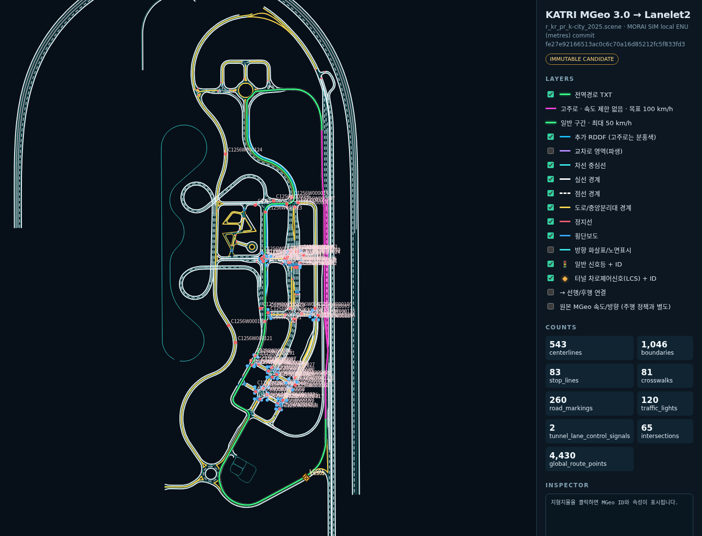

# hd_map_pkg

MORAI 공식 조직의 KATRI MGeo 3.0 스냅샷을 immutable 후보로 고정하고, 이를
WGS84 기반 Lanelet2 OSM으로 변환·검증하며 브라우저에서 시각 검사하는 오프라인
도구다.

> **INTERFACE LOCK:** 이 패키지는
> [`ros_architecture_pkg`](../ros_architecture_pkg/README.md)의 중앙 ROS 계약을
> 따른다. 현재 계약에 node/topic/frame이 없으므로 ROS publisher나 임의의 `map`
> frame을 만들지 않는다. 미리보기는 ROS와 독립된 로컬 HTML Canvas이다.



[최신 독립 HTML 뷰어 다운로드](docs/KATRI_hd_map_preview.html) — GitHub에서는 보안상
HTML을 페이지 안에서 실행하지 않으므로 파일을 내려받아 브라우저로 연다.

## 현재 산출물

`hd_map_tool build-all`은 다음 파일을 `data/derived/`에 재현 가능하게 생성한다.

| 파일 | 내용 |
|---|---|
| `KATRI_lanelet2.osm` | 원본 feature와 semantic segment를 포함한 Lanelet2 OSM 0.6 |
| `KATRI_routing_graph.json` | source link와 확장된 lanelet segment의 명시적 fallback 그래프 |
| `KATRI_lanelet2_id_map.json` | MGeo link 1개 ↔ lanelet relation 1개 이상 대응표 |
| `KATRI_hd_map_preview.html` | 초록색 전역경로를 포함한 레이어 토글·pan/zoom·클릭 검사용 독립 뷰어 |
| `KATRI_source_manifest.json` | 원본 파일별 raw/CRLF SHA-256, 설정 commit/tree, dedupe alias |
| `KATRI_validation_report.json` | 원본·좌표·OSM·규제요소·라우팅 검사 결과 |

파생물은 크기가 크므로 Git에 커밋하지 않는다. 설정·코드·고정된 submodule로 언제든
다시 만든다.

## 원본 고정

원본은 `vendor/verdict_sdk` submodule의 다음 상태다.

- repository: `https://github.com/MORAI-Autonomous/verdict-sdk.git`
- commit: `fe27e92166513ac0c6c70a16d85212fc5f833fd3`
- KATRI tree: `b69c55ce910bfd4e17d709312d7ec47fde9d798e`
- path: `map-data/KATRI`
- format: MGeo 3.0, WGS84 / UTM zone 52N

처음 받은 뒤에는 다음처럼 초기화한다.

```bash
git submodule update --init --recursive
```

원본 JSON은 절대 수정하거나 줄바꿈을 정규화하지 않는다. `_0`, `_1`, `_2`
접미사 복제본은 base 객체가 존재하고 모든 geometry·속성·정규화된 참조가 strict
equal일 때만 importer의 파생 뷰에서 접는다. 충돌은 validator 실패다.

라이선스 주의: `global_info.json`의 `license` 값은 `MORAI`지만 upstream 저장소에서
별도의 재배포 라이선스 문서를 찾지 못했다. 그래서 데이터를 vendoring하지 않고
공식 저장소를 가리키며, 사용·배포 권리는 MORAI/대회 운영측 확인 전까지 미확정이다.

## 실행

저장소 루트에서:

```bash
PYTHONPATH=src/hd_map_pkg/src \
python3 src/hd_map_pkg/scripts/hd_map_tool build-all --open
```

catkin 빌드 뒤에는 다음과 같이 실행할 수 있다.

```bash
source devel/setup.bash
rosrun hd_map_pkg hd_map_tool build-all --open
```

부분 명령은 `inspect-source`, `convert`, `validate`, `view --open`이다. 다른 원본이나
출력 위치를 시험할 때만 전역 옵션 `--source`, `--output-dir`, `--config`를 쓴다.

```bash
hd_map_tool --output-dir /tmp/katri_lanelet build-all
```

## 좌표계

KATRI JSON point는 `global_info.local_origin_in_global` 기준의 local metre 좌표다.
`workspace_origin`은 편집기 metadata이므로 변환에 사용하지 않는다.

```text
UTM 52N       = MGeo local + (305390, 4122845, 0)
SIM local ENU = UTM 52N - (302595, 4124145, 0)
              = MGeo local + (2795, -1300, 0)
OSM lat/lon   = inverse_UTM52N(UTM 52N)
```

OSM node는 WGS84 `lat/lon`과 `ele`을 갖는다. 제공된 4,430점 SIM 전역경로와 변환한
link centerline의 정합도도 매 빌드에서 검사한다.

전역경로 TXT의 XYZ는 이미 실행 scene의 SIM local ENU이므로 다시 좌표 변환하지 않는다.
독립 HTML 뷰어에는 4,430점을 순서와 중복까지 그대로 보존해 기본 활성화된 초록색
`전역경로 TXT` 레이어로 겹쳐 표시한다. 이 경로는 시각 정합용 overlay이며 Lanelet2
OSM의 lanelet 또는 regulatory element로 삽입하지 않는다.
브라우저 미리보기의 표시 범위와 포함 지형지물은 현장 경로 수정에 대비해 이 전역경로의
XY 범위에서 사방 30 m까지로 제한한다. 이 제한은 미리보기 전용이며 Lanelet2 OSM과
routing graph에는 적용하지 않는다.
북쪽 현장 수정 여유는 도로 경계 `B2256W001824`와 `B2256W000157`의 전체 형상까지
연속된 사각 영역으로 확장한다. 두 원본 경계선 자체를 임의로 연결하거나 수정하지 않는다.
터널의 `LCS01`/`LCS02`는 일반 교차로 신호와 분리해 주황색 마름모의
`터널 차로제어신호(LCS)` 레이어로 표시하고 원본 subtype과 연결 정보를 보존한다.

## Lanelet2 매핑

- canonical MGeo link 하나는 boundary fragment의 의미 변화 지점에서 잘려 하나 이상의
  `type=lanelet` relation이 된다. 현재 고정 스냅샷은 source link 1,317개에서 lanelet
  2,346개를 만들며 559개 link가 1:N으로 분할된다.
- 각 segment는 같은 source `mgeo:id`를 유지하고 `mgeo:segment_id=<link>#<index>`,
  `mgeo:segment_index`, `mgeo:segment_count`, 시작·끝 chainage를 기록한다.
- relation member는 `left`, `right`, 명시적 `centerline`, 필요 시
  `regulatory_element`다. 원본 boundary way는 감사용으로 그대로 두고 lanelet member에는
  해당 chainage에 맞춰 자른 boundary way를 사용한다.
- 제한속도는 `speed_limit="N km/h"`, `related_signal`은
  `turn_direction=straight|left|right`다. U-turn은 `mgeo:maneuver=uturn`으로 보존한다.
- source가 없는 쪽은 `type=virtual`, `mgeo:synthetic=yes`인 폭 기반 경계를 만든다.
- lateral bound는 source boundary ID, 선 의미, 잘린 전체 geometry와 endpoint identity가
  모두 같을 때만 같은 OSM way를 공유한다. 일부만 겹치거나 떨어진 경계를 가까워 보인다는
  이유로 합치지 않는다. `can_move_*`와 lateral destination은 명시적 routing JSON에
  보존되며, 공유 way가 없는 관계를 native Lanelet2 lane change로 가장하지 않는다.
- 내부 segment와 source successor는 양쪽 bound endpoint를 안전하게 합칠 수 있을 때만
  native Lanelet2 topology를 만든다. 나머지는 `KATRI_routing_graph.json` v2가 source와
  segment 수준의 선행/후행을 보존한다. 이 JSON은 Lanelet2 OSM 표준 요소가 아니므로
  사용하는 planner가 fallback을 명시적으로 읽어야 한다.

경계선 매핑은 다음과 같다.

| MGeo/NGII | Lanelet2 | 비고 |
|---|---|---|
| `503/504/506/515/525` + broken | `line_thin/dashed` | `lane_change=yes`; MGeo 이동 flag는 routing JSON에 별도 보존 |
| 위 타입 + solid | `line_thin/solid` | 변경 불가 |
| `501` | `line_thick` + source shape | 중앙선; KATRI 원본은 single solid |
| `502` | `line_thick` + source shape | 넓은 U-turn marking |
| `505`, `531` | `road_border` | 도로 외곽/중앙분리대 경계 |
| `530` | `stop_line` | 차로 횡단선 |
| `535` | `road_marking/bike_marking` | lane bound가 아닌 독립 표시 |

`lane_color`, 복합 형상(`solid_dashed`, `dashed_solid`)과 원본 코드는 모두 보존한다.
진행방향 때문에 way를 뒤집을 때 비대칭 subtype도 함께 뒤집는다.
XY distinct point가 하나뿐인 source boundary 5개는 유효한 OSM way가 될 수 없어
내보내지 않고 `degenerate_source_boundaries` warning과 ID 목록으로 남긴다.

정지선은 incoming link의 downstream 40 m 안에서 실제 centerline과 교차하는 `530`
라인만 신호 규제의 `ref_line`으로 쓴다. 차량 신호는 synced group → signal node →
incoming approach로 연결하고, 보행 신호는 횡단보도 area에 연결한다. 신호의 runtime
phase/state는 정적 지도 정답으로 저장하지 않는다. 한 signal head의 접근 차로들이 서로
다른 정지선을 쓰면 signal geometry는 재사용하되 stop-line group별 regulatory element로
나눈다. 각 relation은 `mgeo:regulatory_instance`로 구분되며 `ref_line`은 최대 하나다.

`singlecrosswalk_set`의 `5321`과 `533`은 모두 `subtype=crosswalk`,
`participant:pedestrian=yes`, `one_way=no`다. `533`만 `mgeo:raised=yes`를 추가한다.
`534`는 `subtype=bicycle_crossing`, `participant:bicycle=yes`, `one_way=no`이며 보행
crosswalk로 태그하지 않는다. `544`는 실제로 오르막 경사면 표시이므로
`road_marking/uphill_slope_marking`으로 분리한다.

차량 신호 규제는 연결된 source link의 마지막 lanelet segment에, 보행 신호 규제는
해당 crossing area에 붙는다. 현재 152개 신호 위치는 모두 보존하지만 source에서
차로·횡단보도 연결을 해소할 수 없는 4개는 geometry만 내보내고 warning 처리한다.

원본 `road_polygon_set`은 비어 있다. 교차로 area는 junction road membership에서
계산한 convex hull이며 `mgeo:derived=yes`로 표시한다. 이것은 시각화와 공간 query를
위한 보조 도형이지 routing의 근거가 아니다. 120 m 기준보다 넓은 hull은
`derived_intersection_geometry` warning으로 구분한다.

세부 근거와 한계는 [provenance.md](docs/provenance.md), 전체 필드 대응은
[schema_mapping.md](docs/schema_mapping.md)를 참고한다.

## 검사와 빌드

```bash
python3 -m unittest discover -s src/hd_map_pkg/test -v
catkin_make --pkg hd_map_pkg
catkin_make run_tests_hd_map_pkg
catkin_test_results
```

자체 validator는 다음을 fail/warning/pass로 분리한다.

- submodule commit/tree 및 원본 dirty 여부
- MGeo 3.0 schema, suffix clone strict dedupe, 모든 주요 foreign key
- OSM XML 및 node/way/relation reference 무결성
- source link별 1:N segment index/count/chainage와 left/right/centerline coverage
- non-degenerate 경계선 속성 coverage와 의도적으로 생략한 degenerate 경계 목록
- surface marking 1:1 area와 source link별 lanelet segment 연결
- `5321`/`533` 보행 및 `534` 자전거 crossing 의미
- stop line, crosswalk, traffic-light regulatory association과 미연결 신호
- MGeo successor·내부 segment의 native 공유 endpoint topology
- 명시적 routing graph의 source/segment predecessor·successor, lane-change 필드와 relation ID 대응
- 파생 intersection hull의 크기 warning
- 제공 SIM 전역경로의 centerline 좌표 정합

## 담당 범위

이 패키지는 정적 map/version/hash/CRS/layer/topology/rule만 소유한다. 실시간 ego pose,
동적 신호 상태·객체, route 진행 상태, local trajectory와 제어는 각각 해당 패키지의
책임이며 여기서 publish하지 않는다.

## 디렉터리

- `config/`: 원본 pin, 좌표계, layer mapping, validation 설정
- `docs/`: 출처, schema, 변환·정합 근거
- `scripts/`: 얇은 CLI entry point
- `src/hd_map_pkg/`: importer, 좌표 변환, exporter, validator, viewer
- `test/`: dependency-free 회귀 테스트
- `vendor/verdict_sdk/`: 공식 원본을 가리키는 고정 submodule
- `data/derived/`: 재생성 가능한 비커밋 산출물
