# hd_map_pkg

> **PUBLIC INTERFACE LOCK v1.0.0:** 아래 node/topic/type은
> [`interface_contract.yaml`](../ros_architecture_pkg/config/interface_contract.yaml)의
> 읽기용 투영이다. 통합 시 정확히 일치해야 하며 이 README에서 독립 변경하지 않는다.

## 담당 범위

- 공식 지도 원본과 파생 HD Map의 버전·해시·좌표 메타데이터 관리
- 차선 중심선/경계, 실선/중앙선, topology와 drivable area 표현
- 정지선·교차로·신호등 연결, 속도 규칙과 Localization landmark 표현
- 정적 지도 로더, 변환기와 geometry/topology 검증
- 공식 전역경로·체크포인트·Link ID와 지도 레이어의 대응 근거 제공

## 담당하지 않는 범위

- 실시간 ego pose, 동적 객체, route 진행 상태
- 장애물 회피 local trajectory와 제어
- sample scene의 NPC·신호 상태를 정적 지도 정답으로 저장

## 현재 자료의 한계

`참고파일들/2026_molit_comp_global_path (3).txt`는 4,430개 XYZ 포인트의 전역경로이지 HD Map이 아니다. 차선 경계, 연결 관계, 정지선, 신호 연계와 주행 가능 영역 원본이 아직 없다. 필요한 레이어와 실제 시뮬레이터 정합을 검증하기 전에는 HD Map을 완료로 표시하지 않는다.

공식 맵명 `R-KR_PG_K-City_2025`와 sample scene의 `R_KR_PR_K-city_2025`도 다르므로 임의로 동일한 맵으로 확정하거나 원본을 수정하지 않는다.

## 공개 ROS 입출력

현재 상태는 **이름 승인, 구현 예약**이며 공개 경계 노드는
`hd_map_server_node`다. ROS 입력은 없고 검증된 immutable 지도 파일과 config만
읽는다.

- [Mermaid 원본](docs/interface_io.mmd)
- [PNG 이미지](docs/interface_io.png)

**공개 node (exact):** `hd_map_server_node`

| 구분 | Topic | Type |
|---|---|---|
| 출력 | `/molit/map/hd_map` | `common_msgs_pkg/HdMap` |
| 출력 | `/molit/map/status` | `common_msgs_pkg/ComponentStatus` |

공유 custom type은 이름만 예약됐고 실제 `.msg` schema는 아직 구현되지 않았다.

## 통합 전 자체 확인

- 노드의 통합 실행 이름이 정확히 `hd_map_server_node`인지 확인한다.
- 지도 version/hash/frame 검증 전에는 공개 출력을 valid로 발행하지 않는다.
- 내부 topic은 `/molit/internal/hd_map/...` 또는 private name만 사용한다.
- 공개 이름을 remap하지 않고 중앙 계약 생성 검사를 통과시킨다.

## 완료 기준

- 중앙 좌표계와 원점 검증
- 모든 필수 레이어의 schema·hash·coverage 기록
- 전역경로·체크포인트와 topology 대응 검증
- 시뮬레이터 화면 및 Localization landmark 정합 근거
- 원본과 파생물의 재현 가능한 변환 절차

## 디렉터리

- `config/`: 로더, layer와 validation 설정
- `docs/`: 원본 출처, schema, 변환·정합 보고서
- `launch/`: HD Map 단독 로드/검사
- `src/`: map parser, converter와 validator 구현
