# lidar_perception_pkg

> **PUBLIC INTERFACE LOCK v1.0.0:** 아래 node/topic/type은
> [`interface_contract.yaml`](../ros_architecture_pkg/config/interface_contract.yaml)의
> 읽기용 투영이다. 통합 시 정확히 일치해야 하며 이 README에서 독립 변경하지 않는다.

## 담당 범위

- point cloud 유효성 검사, ROI와 지면 분리
- 3D 장애물·객체 군집화, 크기·상대 위치·속도 관측
- free-space와 occupancy 관측
- 측정 timestamp, calibration ID, confidence와 입력 freshness 제공

## 담당하지 않는 범위

- Camera와의 최종 융합, 전역 객체 추적과 planner-ready world model
- 행동 결정, trajectory와 차량 명령
- 시뮬레이터 UDP 직접 수신

## 대회 규정상 유의사항

- 3D LiDAR는 최대 1대이며 `VLP16`, Intensity 방식만 허용된다.
- 회전율은 최대 15 Hz이고 공지 권장은 10 Hz 이하이다.
- 저장소의 제공 Camera 설정에는 LiDAR가 없다. 로컬 MORAI 저장 프로필에서 확인된 LiDAR 위치는 활성 loadout 검증 전까지 후보값으로만 사용한다.
- sample scene의 객체 목록이나 Ground Truth를 검출 결과로 사용하지 않는다.

## 공개 ROS 입출력

현재 상태는 **이름 승인, 구현 예약**이다. 공개 경계 노드는
`lidar_perception_node`다.

- [Mermaid 원본](docs/interface_io.mmd)
- [PNG 이미지](docs/interface_io.png)

**공개 node (exact):** `lidar_perception_node`

| 구분 | Topic | Type |
|---|---|---|
| 입력 | `/molit/sensors/lidar/points` | `sensor_msgs/PointCloud2` |
| 입력 | `/molit/sensors/lidar/status` | `std_msgs/Bool` |
| 출력 | `/molit/perception/lidar/observations` | `common_msgs_pkg/LidarObservationArray` |
| 출력 | `/molit/perception/lidar/status` | `common_msgs_pkg/ComponentStatus` |

공유 custom type은 이름만 예약됐고 실제 `.msg` schema는 아직 구현되지 않았다.

오래된 장애물을 현재 관측처럼 유지하지 않고, sparse VLP16 환경에서의 miss와 uncertainty를 명시한다.

LiDAR frame과 후보 장착 위치는 중앙 [`TF 계약`](../ros_architecture_pkg/config/tf/frame_contract.yaml)을 따른다. Raw point 축이 REP-103으로 정규화됐는지 확인하기 전에는 TF를 발행하지 않는다. 출력 관측은 [`Timestamp 계약`](../ros_architecture_pkg/config/timestamp/timestamp_contract.yaml)에 따라 원본 scan의 측정시각을 유지한다.

## 통합 전 자체 확인

- 노드의 통합 실행 이름이 정확히 `lidar_perception_node`인지 확인한다.
- 위 입력과 출력의 topic/type/frame/stamp가 중앙 계약과 일치해야 한다.
- 내부 topic은 `/molit/internal/lidar_perception/...` 또는 private name만 사용한다.
- 공개 이름을 remap하지 않고 중앙 계약 생성 검사를 통과시킨다.

## 디렉터리

- `config/`: ROI, filter, clustering과 모델 로컬 파라미터
- `docs/`: calibration, 데이터 특성, 알고리즘과 평가 근거
- `launch/`: LiDAR Perception 단독 실행
- `src/`: point cloud 처리와 observation 생성 구현
