# localization_pkg

> **PUBLIC INTERFACE LOCK v1.0.0:** 아래 node/topic/type은
> [`interface_contract.yaml`](../ros_architecture_pkg/config/interface_contract.yaml)의
> 읽기용 투영이다. 통합 시 정확히 일치해야 하며 이 README에서 독립 변경하지 않는다.

## 담당 범위

- GPS, IMU와 Competition Vehicle Status 기반 ego motion/pose 추정
- 승인된 HD Map landmark 및 필요 시 LiDAR map matching 제약 융합
- GPS 정상·blackout·recovery 상태 전이 및 추정 불확실성 관리
- smooth local motion과 globally referenced pose 관계 유지
- pose history, velocity, covariance, freshness와 localization quality 제공

## 담당하지 않는 범위

- 동적 객체 tracking, 경로 진행도, 행동 결정과 제어
- 체크포인트나 전역경로 좌표를 위치 센서로 주입
- sample scene ego pose를 본선 Ground Truth로 사용

## 대회 규정상 유의사항

- GPS는 최대 1대·30 Hz, IMU는 최대 1대·50 Hz다. 올해는 한시적으로 Noise를 인가하지 않는다(루트 README의 규정 발췌 근거 참조).
- GPS blackout은 예외가 아니라 반드시 지원해야 하는 운용 상태다.
- Vehicle Status에는 절대 위치와 일부 운동 상태가 제공되지 않는다.
- blackout 중 마지막 GPS 값을 새 절대 위치처럼 계속 내보내지 않는다.

## 공개 ROS 입출력

현재 상태는 **EKF 코어 이식, 공개 ROS 런타임 구현 예약**이며 공개 경계 노드는
`localization_node`다.

- [Mermaid 원본](docs/interface_io.mmd)
- [PNG 이미지](docs/interface_io.png)

**공개 node (exact):** `localization_node`

| 구분 | Topic | Type |
|---|---|---|
| 입력 | `/molit/sensors/gps/fix` | `sensor_msgs/NavSatFix` |
| 입력 | `/molit/sensors/imu/data` | `sensor_msgs/Imu` |
| 입력 | `/molit/sensors/lidar/points` | `sensor_msgs/PointCloud2` |
| 입력 | `/molit/vehicle/twist` | `geometry_msgs/TwistWithCovarianceStamped` |
| 입력 | `/molit/map/hd_map` | `common_msgs_pkg/HdMap` |
| 입력 | `/molit/map/status` | `common_msgs_pkg/ComponentStatus` |
| 출력 | `/molit/localization/local/odometry` | `nav_msgs/Odometry` |
| 출력 | `/molit/localization/ego_state` | `common_msgs_pkg/EgoState` |
| 출력 | `/molit/localization/status` | `common_msgs_pkg/LocalizationStatus` |

`/molit/sensors/lidar/points`는 HD Map 정합을 구현할 때만 사용하며 현재 LiDAR
transport 검증 전에는 필수 입력으로 활성화하지 않는다. `/molit/vehicle/twist`는
Competition packet 검증 전 사용 금지다. `ComponentStatus`, `EgoState`,
`LocalizationStatus`의 스키마만 구현됐으며 노드와 나머지 타입은 미구현이다.

세 타입의 필드·단위·invalid 계약과 이식 지침은
[core messages](../ros_architecture_pkg/docs/core_messages.md)를 따른다.
`EgoState`는 허용 센서를 이용한 추정값이지 Competition Vehicle Status의
절대 위치가 아니다. 패킷에 없는 vel_y/vel_z 및 가속도를 0 관측으로 융합하지 않는다.
미추정 성분은 validity mask를 false로 두고, 모델 가정과 실제 관측을 구분한다.

Local Odometry는 연속 motion 추정이지 절대 Ground Truth가 아니다. World Model이 과거 관측을 정확한 시각의 pose로 변환할 수 있도록 bounded pose history를 제공해야 한다.

동적 `map -> odom -> base_link` 관계는 중앙 [`TF 계약`](../ros_architecture_pkg/config/tf/frame_contract.yaml)에 따라 이 패키지가 단일 소유한다. 추정값과 pose history의 시각 의미는 중앙 [`Timestamp 계약`](../ros_architecture_pkg/config/timestamp/timestamp_contract.yaml)을 따르며, GPS 수신시각과 상태 추정 유효시각을 혼동하지 않는다.

## 통합 전 자체 확인

- 노드의 통합 실행 이름이 정확히 `localization_node`인지 확인한다.
- Local Odometry를 절대 `map` 위치나 Ground Truth로 취급하지 않는다.
- `nav_msgs/Odometry`는 `header.frame_id=odom`, `child_frame_id=base_link`를 사용한다.
- `EgoState`는 map pose와 base_link 기준 motion을 분리해 보존한다.
- 위 topic/type/frame/stamp와 GPS blackout quality 전이를 중앙 계약에 맞춘다.
- 내부 topic은 `/molit/internal/localization/...` 또는 private name만 사용한다.
- 공개 이름을 remap하지 않고 중앙 계약 생성 검사를 통과시킨다.

## 디렉터리

- `config/`: filter, gate, timeout과 상태 전이 파라미터
- `docs/`: 좌표계, sensor model, blackout/recovery와 검증 근거
- `launch/`: Localization 단독 실행
- `src/`: projection, estimation, gating과 quality 구현

## 가져온 EKF 구현과 활성화 범위

`feature/localization_pkg`의 GPS/IMU 15-state error-state EKF 코어와 C++ 테스트,
설정, 설계 문서, 기존 ROS adapter 소스를 가져왔다. 현재 빌드 대상은
`localization_ekf` 라이브러리와 테스트뿐이다.

`src/ego_state_estimator_node.cpp`는 이전 계약의 참고 소스로 보존하며 빌드·설치·실행하지 않는다.
이 소스가 요구하는 이전 quality 메시지는 현재 공통 메시지에 없고 node/topic/frame도
현재 계약과 다르다. `docs/localization_design.md`의 원본 설계는 과거 구현 설명이며
공개 ROS 계약을 정의하지 않는다. `config/localization.yaml`도 이식된 후보 파라미터이며
현재 launch에서 로드하지 않는다.

첫 GPS 원점과 GPS 이동 방향 기반 초기화, GPS 보정으로 변하는 위치를 중앙 계약의
연속 `odom` 또는 `map` pose로 곧바로 취급해서는 안 된다. 현재 세 공개 출력에 대한
adapter, map/odom 분리, timestamp·freshness·reset 처리와 센서 축 검증은 후속 작업이다.
