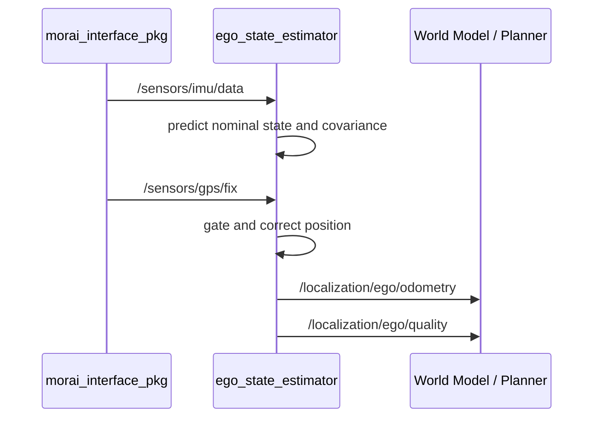
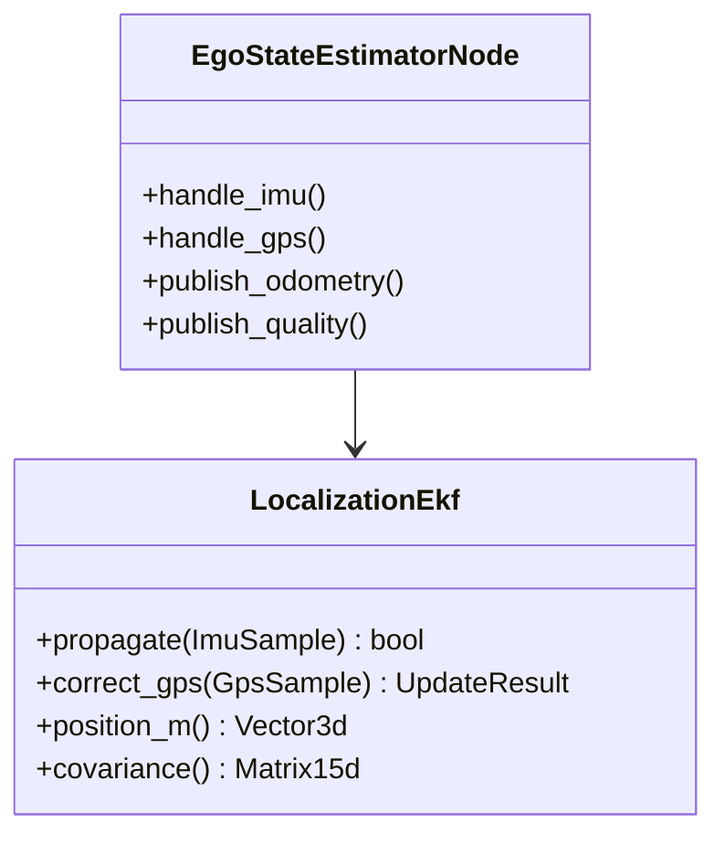

# localization_pkg

> **INTERFACE LOCK:** 이 패키지는 [`ros_architecture_pkg`](../ros_architecture_pkg/README.md)의 중앙 ROS 계약을 따른다. 구체 node/topic/message/frame 이름은 여기서 정의하지 않는다.

## 담당 범위

- GPS, IMU와 Competition Vehicle Status 기반 ego motion/pose 추정
- 승인된 HD Map landmark 및 필요 시 LiDAR map matching 제약 융합
- GPS 정상·noise·blackout·recovery 상태 전이
- smooth local motion과 globally referenced pose 관계 유지
- pose history, velocity, covariance, freshness와 localization quality 제공

## 담당하지 않는 범위

- 동적 객체 tracking, 경로 진행도, 행동 결정과 제어
- 체크포인트나 전역경로 좌표를 위치 센서로 주입
- sample scene ego pose를 본선 Ground Truth로 사용

## 대회 규정상 유의사항

- GPS는 최대 1대·30 Hz, IMU는 최대 1대·50 Hz이며 noise 범위는 미공개다.
- GPS blackout은 예외가 아니라 반드시 지원해야 하는 운용 상태다.
- Vehicle Status에는 절대 위치와 일부 운동 상태가 제공되지 않는다.
- blackout 중 마지막 GPS 값을 새 절대 위치처럼 계속 내보내지 않는다.

## 논리 입출력

- 입력: 정규화된 GPS/IMU/차량 상태, 승인된 calibration, 정적 map constraint
- 출력: 시간 인덱스가 있는 ego state, pose history, uncertainty와 명시적 quality state

Local Odometry는 연속 motion 추정이지 절대 Ground Truth가 아니다. World Model이 과거 관측을 정확한 시각의 pose로 변환할 수 있도록 bounded pose history를 제공해야 한다.

## 디렉터리

- `config/`: filter, gate, timeout과 상태 전이 파라미터
- `docs/`: 좌표계, sensor model, blackout/recovery와 검증 근거
- `launch/`: Localization 단독 실행
- `src/`: projection, estimation, gating과 quality 구현

## 1차 구현: IMU 예측 + GPS 보정

`ego_state_estimator`는 `sensor_msgs/Imu`와 `sensor_msgs/NavSatFix`를 구독한다. 첫 정상 GPS를
`local_enu`의 원점으로 두고, 이후 최소 이동거리를 만족하는 GPS 이동 방향으로 초기 yaw를 정한다.
초기화가 끝난 뒤 IMU는 위치·속도·quaternion 자세·IMU bias를 예측하고, GPS는 위치만 보정한다.

출력은 `nav_msgs/Odometry`와 `common_msgs_pkg/LocalizationQuality`다. GPS blackout 동안 odometry는
새 IMU가 들어오는 한 계속 발행되지만 quality가 `DEGRADED`로 전환되고 공분산이 커진다. IMU가
stale이거나 최대 dead-reckoning 시간을 넘으면 quality는 `INVALID`다.

LiDAR 융합은 후속 정적 지도 기반 pose constraint를 위한 측정 업데이트 경계만 남겼으며, 이번 버전에는
LiDAR 토픽, map matching, ICP/NDT 또는 객체 인식이 없다. 상세 설계는
[`docs/localization_design.md`](docs/localization_design.md)에 있다.
