# morai_interface_pkg

> **PUBLIC INTERFACE LOCK v1.0.0:** 아래 node/topic/type은
> [`interface_contract.yaml`](../ros_architecture_pkg/config/interface_contract.yaml)의
> 읽기용 투영이다. 통합 시 정확히 일치해야 하며 이 README에서 독립 변경하지 않는다.

## 담당 범위

- MORAI와 통신하는 유일한 외부 네트워크 경계
- 허용 UDP 패킷의 길이·필드·byte order·sequence·timestamp 검증
- Camera, LiDAR, GPS, IMU, 차량 상태와 충돌 정보의 내부 형식 정규화
- 최종 승인된 차량 명령을 대회 패킷으로 직렬화하여 송신
- 연결 여부, 수신 age, packet drop과 decode 오류 상태 제공

## 현재 이식된 UDP → ROS 어댑터

지정된 기존 저장소의 `morai_udp_bridge` 중 **MORAI 수신 방향만** 이
패키지 아래로 이식했다. 원본과 변경 근거는
[`docs/morai_udp_bridge_import.md`](docs/morai_udp_bridge_import.md), 중앙 이름과
활성화 상태는
[`udp_ros_bridge.yaml`](../ros_architecture_pkg/config/morai_interface/udp_ros_bridge.yaml)이
유일한 기준이다.

| 채널 | ROS 출력 | 현재 상태 |
|---|---|---|
| Front/Left/Right Camera | `sensor_msgs/CompressedImage` | 라이브 UDP→ROS 발행 확인 |
| GPS | `sensor_msgs/NavSatFix` | 같은 epoch 중복 방지 GGA-only, 라이브 valid fix 확인 |
| IMU | `sensor_msgs/Imu` | 공식 NetworkModule 24.R2.0 구조와 parser 일치, 라이브 축·단위 검증 대기 |
| LiDAR | `sensor_msgs/PointCloud2` | 외부 Velodyne driver 방식, 라이브 packet·축 검증 대기 |
| Vehicle Status | `geometry_msgs/TwistWithCovarianceStamped` | 구형 packet이라 사용 금지 상태 |

ROS → MORAI 제어 sender는 이번 이식 범위가 아니다. 기존 센서 브리지 5종은
다음 명령으로 한 번에 실행한다.

```bash
roslaunch morai_interface_pkg morai_interface_pkg.launch \
  start_imu:=true start_lidar:=true start_lidar_watchdog:=true
```

기본 개발 포트는 Camera 9291/9293/9295, GPS 7801, IMU 7802, VLP16 2368이다.
이는 대회 고정 포트가 아니라 Team2 수신 설정이므로 MORAI Network Settings의
destination IP/port를 실행 PC와 이 YAML 값에 맞춰야 한다. IMU는 중앙 개발 계약 범위에서 명시적으로 활성화하고, LiDAR는
격리된 연결 시험에서만 활성화한다.
필요한 센서만 실행할 때는 `start_cameras:=false` 같은 launch 인자를 사용한다. LiDAR에는
ROS Noetic `velodyne_driver`, `velodyne_pointcloud`, `velodyne_msgs`, `nodelet`이
필요하다.

IMU parser의 구조 근거는 MORAI 공식
[`24.R2.0/lib/define/IMU.py`](https://github.com/MORAI-Autonomous/MORAI-NetworkModule/blob/24.R2.0/lib/define/IMU.py)다.
2026-09-10 IMU packet 수신과 정지 가속도 크기를 확인했고, 사용자 요청에 따라
중앙 계약에서 개발 Localization 입력을 허용한다. 공식 문서 축 정의를 사용하되
완전한 회전/roll/pitch 물리 정합과 covariance 정확도는 미검증이다.
개별·통합 launch의 IMU/LiDAR 기본 `false` gate는 실수 실행 방지를 위해 유지한다.
MORAI 설정부터 topic별 성공 조건까지는
[`센서 연결 실행 절차`](docs/sensor_connection_runbook.md)를 따른다.

`CollisionData` 수신과 `Ego Ctrl Cmd` 송신은 중앙 공개 이름만 예약돼 있다.
상세 UDP 계약에도 `runtime_activation_allowed: false`인 명시적 stub을 두며,
공식 port·packet layout·timestamp와 제어 watchdog을 확인하기 전에는 구현하거나
launch에 추가하지 않는다.

## 대회 규정상 유의사항

- 허용 항목은 Ego 제어, CollisionData, Competition Vehicle Status, GPS, IMU, Camera와 3D LiDAR뿐이다.
- 제어는 `cmd type = 1`, `ctrl mode = 2` 계약을 지켜야 한다.
- Ground Truth, Bounding Box, V2I/V2V, ROS Bridge 또는 숨은 시뮬레이터 상태를 주행 입력으로 사용하지 않는다.
- 참고 카메라 JSON의 loopback IP와 port는 현재 파일 값일 뿐 본선 네트워크 계약이 아니다.

## 공개 ROS 입출력

### 로컬 MORAI Q 전환

MORAI의 Driving Info → Status Initialization은 **OFF**로 설정한다.
2026-09-22 실주행에서 ON 상태는 가속 명령 100%에도 속도가 오르지 않았고,
OFF 전환 후 가속·감속과 전역경로 추종이 회복됐다. 이 옵션은 시뮬레이터
설정이므로 Git checkout만으로 변경되지 않는다.

`config/global_path_demo.yaml`은 `local_q_guard_enabled: true`로 로컬
X11 MORAI 창의 Q 입력을 감지한다. Q를 누른 동안과 놓은 뒤
`local_q_handover_sec`(0.5초) 동안 제어 UDP를 중단해 모드 전환을 허용한다.
실행 시 자율주행으로 시작하며, Q를 한 번 누르면 송신 중단을 유지하고
다시 누르면 새 Safety 명령의 송신을 재개한다. 키를 길게 눌러도 한 번만
전환하며 다른 창의 Q는 무시한다. MORAI 자체 Q 전환과 함께 사용하므로
모드 변경은 MORAI 창에서 Q로 수행한다. 별도 모드 UDP 수신은 사용하지 않는다.
이 기능은 로컬 X11 화면 접근과
`libX11.so.6`이 필요하며 기본 송신 설정에서는 꺼져 있다.



- [Mermaid 원본](docs/interface_io.mmd)
- [PNG 이미지](docs/interface_io.png)

**공개 node (exact):** `morai_camera_front`, `morai_camera_left`, `morai_camera_right`, `morai_gps_bridge`, `morai_imu_bridge`, `morai_vehicle_status_bridge`, `morai_velodyne_cloud`, `morai_lidar_watchdog`, `morai_collision_bridge`, `morai_interface_status_node`, `morai_control_sender`

| 구분 | Topic | Type |
|---|---|---|
| 입력 | `/molit/safety/final_command` | `common_msgs_pkg/ActuatorCommand` |
| 출력 | `/molit/sensors/camera/front/image/compressed` | `sensor_msgs/CompressedImage` |
| 출력 | `/molit/sensors/camera/left/image/compressed` | `sensor_msgs/CompressedImage` |
| 출력 | `/molit/sensors/camera/right/image/compressed` | `sensor_msgs/CompressedImage` |
| 출력 | `/molit/sensors/gps/fix` | `sensor_msgs/NavSatFix` |
| 출력 | `/molit/sensors/imu/data` | `sensor_msgs/Imu` |
| 출력 | `/molit/vehicle/twist` | `geometry_msgs/TwistWithCovarianceStamped` |
| 출력 | `/molit/sensors/lidar/points` | `sensor_msgs/PointCloud2` |
| 출력 | `/molit/sensors/lidar/status` | `std_msgs/Bool` |
| 출력 | `/molit/events/collision` | `common_msgs_pkg/CollisionEvent` |
| 출력 | `/molit/interface/status` | `common_msgs_pkg/InterfaceStatus` |

공개 경계 node는 `morai_camera_front`, `morai_camera_left`,
`morai_camera_right`, `morai_gps_bridge`, `morai_imu_bridge`,
`morai_vehicle_status_bridge`, `morai_velodyne_cloud`,
`morai_lidar_watchdog`, `morai_collision_bridge`,
`morai_interface_status_node`, `morai_control_sender`다. Camera/GPS만 현재
live transport를 확인했고, IMU/LiDAR는 개발 실행 가능하지만 live packet 검증
대기 상태다. Control/Collision/Interface status와 관련 custom type은 이름만
예약된 상태다.

패킷 명세가 확보되기 전에는 포트나 필드 구조를 추측해 구현하지 않는다. stale 패킷을 새 데이터처럼 재발행하지 않으며 연결 상실 시 명시적인 invalid 상태를 제공한다.
향후 `morai_control_sender`에는 consumer-side watchdog을 두고 Safety 입력이
끊기면 마지막 비영점 명령을 반복하지 않는다. 제어 packet과 timeout이 검증되기
전에는 sender를 활성화하거나 추측한 정지 packet을 송신하지 않는다.

현재 이식본의 parser/loopback 테스트는 자체 생성 패킷을 검증한다. 이는 본선
Competition packet 호환이나 센서 축·단위의 실측 증거가 아니다.

## 통합 전 자체 확인

- launch의 공개 node 이름과 위 topic/type이 중앙 계약과 정확히 일치해야 한다.
- `morai_control_sender`는 `/molit/safety/final_command`만 제어 입력으로 받는다.
- final command가 누락·stale이면 마지막 비영점 명령을 절대 재사용하지 않는다.
- 다른 패키지가 UDP socket을 열거나 `/molit/internal/morai_interface/...`를 구독하지 않게 한다.
- disabled/prohibited 채널을 패킷 근거 없이 활성화하지 않는다.
- 공개 이름을 remap하지 않고 중앙 계약 생성 검사와 adapter contract test를 통과시킨다.

## 디렉터리

- `config/`: 검증된 네트워크와 packet 설정
- `docs/`: 실제 packet capture, 버전과 연동 근거
- `launch/`: 이 interface만 단독 실행
- `src/morai_udp_bridge/`: 이식된 수신 transport, parser와 ROS publisher
- `scripts/`: ROS node 진입점
- `test/`: parser, UDP loopback과 중앙 계약 정합성 검사

## 전역경로 추종 시험 (2026-09-21)

사용자가 요청한 현재 시뮬레이터 전용 실행은
[global_path_demo 중앙 프로필](../ros_architecture_pkg/config/messages/global_path_demo.yaml)을 따른다.
`roslaunch system_bringup_pkg global_path_demo.launch`로 기존 Localization에 연결해
전역경로만 10 km/h로 추종한다. 일반 실행과 구분된 개발용 직접 전달 경로이며
장애물·신호 판단을 수행하지 않는다. 별도 방어 계층은 추가하지 않았다.
실제 상태와 실행·중지 방법은 [실행 기록](../ros_architecture_pkg/docs/global_path_demo.md)에 기록한다.
