# path_planning_pkg

> **PUBLIC INTERFACE LOCK v1.0.0:** 아래 node/topic/type은
> [`interface_contract.yaml`](../ros_architecture_pkg/config/interface_contract.yaml)의
> 읽기용 투영이다. 통합 시 정확히 일치해야 하며 이 README에서 독립 변경하지 않는다.

## 담당 범위

- Localization의 local odometry·ego state·quality를 사용한 현재 차량 상태 확인
- route context와 진행도를 사용한 behavior planning
- time-aligned World Model의 차로·신호·정지선·장애물·NPC·합류 상황을
  고려한 local motion planning
- 차량 곡률·최소 회전 반경·가감속 한계를 만족하는 시간 파라미터 trajectory
- 입력 freshness, 재계획 상태, 계산 지연, 준비 여부와 trajectory 유효기간 제공
- 실행 가능한 경로가 없을 때 명시적 invalid/stop-required 상태 제공

## 담당하지 않는 범위

- sensor fusion, Localization, 전역 route progress 계산
- actuator 값 생성, Safety 최종 판단과 MORAI UDP 송신
- sample scene의 고정 객체 위치를 본선 계획 정답으로 사용

raw Camera/LiDAR와 개별 Perception 관측은 직접 구독하지 않는다. Camera/LiDAR
Perception은 센서 관측을 소유하고, World Model은 좌표 변환·시간 정렬·융합과
tracking을 소유하며, Planner는 통합된 scene만 사용한다.

## 대회 규정상 유의사항

- 출발 후 1분 이내 경로 5%를 통과하되 다른 안전 규칙을 희생하지 않는다.
- 체크포인트를 순서대로 반경 3 m 이내 통과하도록 route context를 따른다.
- 기본 제한속도는 60 km/h이며 공식 Link 예외는 과속 의무가 아니라 제한 예외다.
- 신호, 실선·중앙선, 충돌 회피, 랜덤 장애물·끼어들기와 15분 완주를 함께 고려한다.
- GPS blackout 구간에서도 Localization/World Model quality에 맞춰 보수적으로 계획한다.

## 공개 ROS 입출력

현재 상태는 **이름 승인, 구현 예약**이며 공개 경계 노드는
`path_planner_node`다. behavior/motion planner와 `Trajectory` schema는 아직
구현·runtime 검증되지 않았다.

- [Mermaid 원본](docs/interface_io.mmd)
- [PNG 이미지](docs/interface_io.png)

**공개 node (exact):** `path_planner_node`

| 구분 | Topic | Type |
|---|---|---|
| 입력 | `/molit/localization/local/odometry` | `nav_msgs/Odometry` |
| 입력 | `/molit/localization/ego_state` | `common_msgs_pkg/EgoState` |
| 입력 | `/molit/localization/status` | `common_msgs_pkg/LocalizationStatus` |
| 입력 | `/molit/route/context` | `common_msgs_pkg/RouteContext` |
| 입력 | `/molit/route/status` | `common_msgs_pkg/ComponentStatus` |
| 입력 | `/molit/world_model/scene` | `common_msgs_pkg/WorldModel` |
| 입력 | `/molit/world_model/status` | `common_msgs_pkg/ComponentStatus` |
| 출력 | `/molit/planning/trajectory` | `common_msgs_pkg/Trajectory` |
| 출력 | `/molit/planning/status` | `common_msgs_pkg/ComponentStatus` |

각 입력은 원본 측정 `header.stamp`와 중앙 timestamp 계약을 따른다. 입력이
누락·stale하거나 clock domain이 다르면 이를 숨기거나 직전 scene을 현재
관측처럼 재사용하지 않고 planning status에 명시한다.

Trajectory의 공개 frame은 제어 연속성을 위해 `odom`으로 고정한다. 공유 custom
type은 이름만 예약된 상태다. v1에서 이 패키지가 생성하는 주행
출력은 `/molit/planning/trajectory`뿐이며 직접 accel/brake/steer 또는
UDP 출력은 금지한다.

생성된 trajectory는 반드시 `vehicle_controller_node`의 nominal command와
`safety_supervisor_node`의 최종 gate를 거친다.

## 통합 전 자체 확인

- 노드의 통합 실행 이름이 정확히 `path_planner_node`인지 확인한다.
- Localization, Route와 World Model 입력의 freshness·frame·timestamp를
  검사하고, 승인되지 않은 raw sensor 또는 Perception topic을 구독하지 않는다.
- 재계획 이유와 trajectory 유효성을 status에 남기고 stale trajectory를
  계속 출력하지 않게 검증한다.
- trajectory의 `header.frame_id=odom`, stamp와 유효기간을 보존한다.
- 위 topic/type만 공개하고 내부 topic은 `/molit/internal/path_planning/...`만 사용한다.
- 공개 이름을 remap하지 않고 중앙 계약 생성 검사를 통과시킨다.

## 디렉터리

- `config/`: behavior, replanning, horizon과 차량 제약 파라미터
- `docs/`: behavior/motion planner 설계와 성능·안전 평가
- `launch/`: Path Planning 단독 실행
- `src/`: behavior and motion planning 구현
