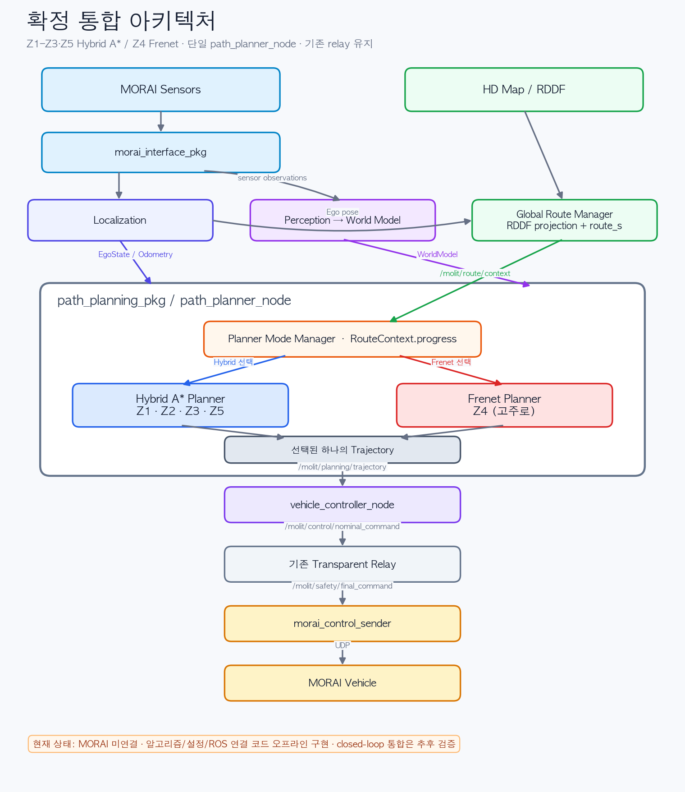

# Planner Mode Manager와 Hybrid A* 통합 기록

## 구현 상태

이 변경은 기존 `main`의 단일 공개 Planning 경계를 유지하면서 다음 기능을
`path_planning_pkg` 내부에 추가한다.

- `PlannerModeManager`: `/molit/route/context.progress`의 `route_s`만으로 Z1~Z5를 판정한다.
- `HybridAStarPlanner`: `morai/test2`의 전진 bicycle arc, 연속 pose/이산 key,
  steering history와 reference guide 원칙을 사용한다.
- 기존 Frenet과 Hybrid A* 중 선택된 하나만 기존 `Trajectory` publisher에 전달한다.
- Planner 종류는 CP10과 CP13 경계에서만 변경한다. 객체 출현은 Planner 종류를
  변경하지 않으며 선택된 Planner의 입력으로만 사용한다.

MORAI 시뮬레이터가 연결되지 않은 상태에서 구현했으므로 ROS topic의 실제 주기,
UDP, TF 지연과 차량 closed-loop 추종 결과는 검증되지 않았다.

## 설정 파일 위치

구간 범위와 Planner 배정의 원본은 다음 파일이다.

```text
src/path_planning_pkg/config/planner_mode.yaml
```

Hybrid A* 탐색과 차량 파라미터는 다음 파일이다.

```text
src/path_planning_pkg/config/hybrid_astar.yaml
```

구간 경계는 시작 포함·끝 미포함이다. 마지막 경로 끝점만 Z5에 포함한다.

| 구간 | route_s 범위 | Planner | 실제 Planner 전환 |
|---|---:|---|---|
| Z1 | 0.000 ≤ s < 237.423 m | Hybrid A* | 시작 모드 |
| Z2 | 237.423 ≤ s < 635.113 m | Hybrid A* | 없음 |
| Z3 | 635.113 ≤ s < 1,118.741751 m | Hybrid A* | 없음 |
| Z4 | 1,118.741751 ≤ s < 1,741.720989 m | Frenet | CP10에서 전환 |
| Z5 | 1,741.720989 ≤ s ≤ 2,184.611723 m | Hybrid A* | CP13에서 전환 |

한 번의 전진 주행을 전제로 Manager가 수신한 최대 `route_s`를 유지한다. 작은
역방향 projection jitter가 들어와도 이전 Planner 구간으로 되돌아가지 않는다.
Localization `reset_id`가 바뀌면 Manager 상태도 초기화한다.

## 내부 구조



| 구성요소 | 구현 파일 | 역할 |
|---|---|---|
| Planner Mode Manager | `src/path_planning_pkg/planner_mode_manager.py` | 구간 판정과 Planner 선택 상태 유지 |
| Hybrid A* core | `src/path_planning_pkg/hybrid_astar.py` | 전진 motion primitive 탐색 |
| Hybrid runtime adapter | `src/path_planning_pkg/hybrid_runtime.py` | RDDF·World Model 입력을 Hybrid A* 요청과 기존 Candidate로 변환 |
| Frenet | `src/path_planning_pkg/frenet.py` | 기존 Z4 경로 계획 |
| 단일 ROS 실행 노드 | `src/frenet_planner_node.py` | 입력 수신, 선택 Planner 실행, 공통 Trajectory 발행 |

파일명은 기존 launch와 중앙 계약을 유지하기 위해 `frenet_planner_node.py`를
그대로 사용한다. 실행되는 ROS node 이름은 기존과 같은 `path_planner_node`다.

## Hybrid A* 구현 범위

`morai/test2`에서 다음 원칙을 가져왔다.

- continuous `(x, y, yaw)` pose와 discretized `(x, y, yaw, steering)` search key
- 전진 전용 constant-steering bicycle motion primitive
- 최소회전반경으로 제한한 steering 후보
- steering 크기와 steering 변화량 비용
- RDDF reference lateral error 비용과 전진 진행도 조건
- 차량 전방/후방 overhang과 폭을 사용한 직사각형 footprint
- World Model의 실제 객체 점과 footprint 직접 교차 검사

다음 요소는 넣지 않았다.

- 별도 Safety Gate, `node_safety` 또는 command 제한 로직
- Occupancy grid 생성 또는 occupancy topic
- raw LiDAR/Camera 직접 구독
- Planner 종류를 객체·속도·실패 상태로 변경하는 로직
- actuator/UDP 명령 생성

Hybrid A*는 현재 객체 점의 위치를 사용한다. Frenet에 있는 시간 기반 동적 객체
예측을 Hybrid A* 탐색 자체에는 이식하지 않았다. 동적 객체의 실제 회피 성능은
MORAI 연결 후 확인해야 한다.

## 공개 ROS 입출력

새 공개 topic은 추가하지 않았다.

| 방향 | Topic | Type | 사용 내용 |
|---|---|---|---|
| 입력 | `/molit/map/hd_map` | `common_msgs_pkg/HdMap` | global RDDF와 map id |
| 입력 | `/molit/localization/ego_state` | `common_msgs_pkg/EgoState` | map pose, yaw, reset id |
| 입력 | `/molit/localization/local/odometry` | `nav_msgs/Odometry` | odom pose와 현재 속도 |
| 입력 | `/molit/localization/status` | `common_msgs_pkg/LocalizationStatus` | 기존 상태 입력 유지 |
| 입력 | `/molit/route/context` | `common_msgs_pkg/RouteContext` | Mode Manager의 `progress`, 경로 목표 |
| 입력 | `/molit/route/status` | `common_msgs_pkg/ComponentStatus` | 기존 Route 상태 입력 유지 |
| 입력 | `/molit/world_model/scene` | `common_msgs_pkg/WorldModel` | map 좌표 객체 점 |
| 입력 | `/molit/world_model/status` | `common_msgs_pkg/ComponentStatus` | 기존 World Model 상태 입력 유지 |
| 출력 | `/molit/planning/trajectory` | `common_msgs_pkg/Trajectory` | 선택된 하나의 odom trajectory |
| 출력 | `/molit/planning/status` | `common_msgs_pkg/ComponentStatus` | zone, mode, 계산 결과와 지연 |

Hybrid A*와 Frenet 결과를 합치지 않는다. 선택된 Planner 결과만 기존
`Candidate` 표현을 거쳐 `Trajectory` 한 개로 직렬화한다.

## 오프라인 검증

- Z1~Z5 경계 포함 규칙
- Z1→Z2→Z3에서 Hybrid A* 유지
- CP10에서 Hybrid A*→Frenet 전환
- CP13에서 Frenet→Hybrid A* 전환
- 역방향 progress jitter가 이전 모드로 복귀시키지 않음
- Localization reset 후 Z1부터 새 주행 가능
- 직선·곡률 bicycle path 생성
- 객체 점을 우회하는 경로 생성
- Hybrid 결과가 기존 `Candidate` 구조와 route_s 순서를 만족
- 실제 K-City Hybrid 구간 표본 13개 지점에서 13개 모두 경로 생성 성공
  (`s=10~2,150 m`, 개별 계산 0.025~0.093초, 현재 개발 PC 기준)
- 샘플 박스 위치에 2×3 m 객체 점을 배치한 회피 검사 성공
  (`s=315 m`에서 계획 시작, 0.183초, 현재 개발 PC 기준)

## MORAI 연결 후 예상되는 통합 문제와 확인 항목

| 항목 | 예상 문제 | 확인 방법 |
|---|---|---|
| Route progress | CP10/CP13 부근 지연·점프 | 실제 `/molit/route/context.progress` 기록과 전환 status 비교 |
| Planner handoff | 첫 Frenet/Hybrid 경로의 위치·접선 차이 | 경계 전후 odom trajectory 곡률과 Controller tracking error 확인 |
| 계산 시간 | Hybrid A*가 5 Hz decision 주기를 넘을 수 있음 | expanded nodes와 `processing_latency_sec` 측정 후 파라미터 조정 |
| 좌표계 | Ego/map 객체와 odom 출력 변환 오차 | map pose와 변환된 첫 trajectory 구간을 RViz에서 비교 |
| 객체 점 | 희소 VLP16 cluster가 footprint 사이로 빠질 수 있음 | 실제 cluster 밀도와 장애물별 통과 경로 재생 검증 |
| 동적 차량 | 현재 Hybrid 탐색은 객체 미래 위치를 예측하지 않음 | 고주로 외 NPC 시나리오에서 재계획 주기와 회피 동작 확인 |
| Corridor 폭 | 고정 6 m local corridor가 실제 좁은/넓은 구간과 다를 수 있음 | K-City 각 구간 replay 후 route 이탈과 탐색 실패 지점 기록 |
| 속도 프로파일 | Hybrid 곡률과 Controller 조향 응답 불일치 가능 | 저속부터 path tracking error와 steering saturation 측정 |
| 실행 구성 | ROS Noetic 의존성·launch parameter 로드 | MORAI 없이 ROS bringup, 이후 MORAI 연결 순으로 확인 |

현재 결과는 알고리즘 및 정적 통합 검증이며 MORAI closed-loop 완주를 의미하지 않는다.
