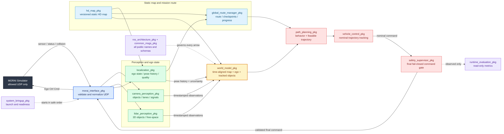

# 전체 시스템 아키텍처

- 편집 원본: [`system_architecture.mmd`](system_architecture.mmd)
- 벡터 이미지: [`system_architecture.svg`](system_architecture.svg)

## 설계 결정

1. Camera와 LiDAR 인식 결과를 Planner가 직접 조립하지 않는다.
2. `world_model_pkg`가 관측 시각의 ego pose history와 승인된 calibration을 사용해 좌표 변환, 시간 정렬, 교차 센서 융합과 추적을 수행한다.
3. Planner는 하나의 일관된 world model과 별도의 route context를 입력으로 사용한다.
4. Controller는 nominal 명령만 만들고 Safety Supervisor가 Controller 뒤에서 최종 명령을 gate한다.
5. 외부 MORAI 통신은 단 하나의 interface package를 통과한다.
6. 평가 패키지는 read-only이며 제어 경로에 연결하지 않는다.

## HD Map 완료 정의

현재 제공된 4,430점 전역경로는 HD Map이 아니다. HD Map을 완료로 선언하려면 최소한 다음 레이어와 검증 근거가 필요하다.

- 좌표계, 원점, 지도 버전과 원본 해시
- 차선 중심선·경계선·실선·중앙선·차선 종류
- 도로·차선 연결 관계와 주행 가능 영역
- 정지선·횡단보도·교차로·신호등 연결
- 속도 제한과 공식 예외 구역
- Localization용 정적 landmark 또는 map-matching 표현
- 공식 전역경로·체크포인트·Link ID 대응

공식 맵명과 sample scene 맵명이 다른 문제, 원본 지도 사용 허가와 실제 시뮬레이터 로드 결과가 해결되기 전에는 “완벽한 HD Map”이라고 표현하지 않는다.

## 시간 정렬 원칙

센서별 최신 메시지를 단순히 한 시점의 값처럼 합치지 않는다. World Model은 각 관측의 측정 timestamp에 해당하는 ego pose를 사용하고, 보간 가능 범위·최대 age·불확실성 전파 기준을 중앙 계약으로 정의해야 한다.

## Calibration 소유권

- `ros_architecture_pkg`: frame tree, transform 방향, 단위와 활성 calibration version 승인
- `camera_perception_pkg`: camera intrinsic/extrinsic 후보 파일과 검증 근거 소유
- `lidar_perception_pkg`: LiDAR extrinsic/time offset 후보 파일과 검증 근거 소유
- `localization_pkg`: GPS/IMU 장착 관계와 estimator에서 사용하는 시간 보정 근거 소유
- `world_model_pkg`: 승인된 calibration을 소비하며 값을 자체 수정하거나 별도 원본으로 복사하지 않음

여러 패키지에 영향을 주는 calibration 변경은 중앙 계약 version, 관련 sensor 설정, World Model 회귀 테스트와 시각 정합 결과를 같은 변경 단위로 갱신한다.
