# runtime_evaluation_pkg

> **PUBLIC INTERFACE LOCK v1.0.0:** 아래 node/topic/type은
> [`interface_contract.yaml`](../ros_architecture_pkg/config/interface_contract.yaml)의
> 읽기용 투영이다. 통합 시 정확히 일치해야 하며 이 README에서 독립 변경하지 않는다.

## 담당 범위

- 출발 1분/5%, 체크포인트 순서·달성도와 15분 제한 기록
- 속도·신호·차로·충돌 이벤트와 예상 패널티 계산
- 완주율, 실제/패널티 포함 시간, 경로 이탈과 mission 결과 기록
- sensor/model latency, data age, packet drop, 제어 진동과 추론 지연 측정
- run ID, scenario, 날씨, 시간, seed, 코드·데이터 버전과 결과 연결

## 담당하지 않는 범위

- 차량 명령 수정, Safety 판단 또는 route/planning 의사결정
- 운영측 판정 프로그램을 대체하거나 자체 결과를 공식 점수로 주장
- 허용되지 않은 시뮬레이터 정보를 평가 편의를 위해 수신

## 대회 규정상 유의사항

- 완주 팀은 두 주행 중 더 짧은 총 시간으로 순위를 정한다.
- 미완주 결과는 체크포인트 달성도가 먼저이고 총 시간이 다음이다.
- 패널티 로직은 규정 버전과 함께 저장하며 운영측 변경 가능성을 표시한다.
- GPS blackout 구간의 차로 패널티 미적용과 차로 안전 필요성을 구분한다.

## 공개 ROS 입출력

현재 상태는 **이름 승인, 구현 예약**이며 공개 경계 노드는
`runtime_evaluator_node`다.

- [Mermaid 원본](docs/interface_io.mmd)
- [PNG 이미지](docs/interface_io.png)

**공개 node (exact):** `runtime_evaluator_node`

| 구분 | Topic | Type |
|---|---|---|
| 입력 | `/molit/events/collision` | `common_msgs_pkg/CollisionEvent` |
| 입력 | `/molit/interface/status` | `common_msgs_pkg/InterfaceStatus` |
| 입력 | `/molit/perception/camera/status` | `common_msgs_pkg/ComponentStatus` |
| 입력 | `/molit/perception/lidar/status` | `common_msgs_pkg/ComponentStatus` |
| 입력 | `/molit/localization/local/odometry` | `nav_msgs/Odometry` |
| 입력 | `/molit/localization/ego_state` | `common_msgs_pkg/EgoState` |
| 입력 | `/molit/localization/status` | `common_msgs_pkg/LocalizationStatus` |
| 입력 | `/molit/route/global_path` | `nav_msgs/Path` |
| 입력 | `/molit/route/context` | `common_msgs_pkg/RouteContext` |
| 입력 | `/molit/route/status` | `common_msgs_pkg/ComponentStatus` |
| 입력 | `/molit/world_model/scene` | `common_msgs_pkg/WorldModel` |
| 입력 | `/molit/world_model/status` | `common_msgs_pkg/ComponentStatus` |
| 입력 | `/molit/planning/trajectory` | `common_msgs_pkg/Trajectory` |
| 입력 | `/molit/planning/status` | `common_msgs_pkg/ComponentStatus` |
| 입력 | `/molit/control/nominal_command` | `common_msgs_pkg/ActuatorCommand` |
| 입력 | `/molit/control/status` | `common_msgs_pkg/ControllerStatus` |
| 입력 | `/molit/system/readiness` | `common_msgs_pkg/SystemReadiness` |
| 입력 | `/molit/safety/final_command` | `common_msgs_pkg/ActuatorCommand` |
| 입력 | `/molit/safety/state` | `common_msgs_pkg/SafetyState` |
| 출력 | `/molit/evaluation/metrics` | `common_msgs_pkg/RunMetrics` |

공유 custom type은 이름만 예약됐고 실제 `.msg` schema는 아직 구현되지 않았다.

이 패키지는 command path와 독립된 read-only observer여야 한다. Sensor packet
통계는 `/molit/interface/status`, perception latency와 drop/invalid 통계는 각
perception status가 제공하는 공통 상태 필드에서 읽으며 raw sensor topic을
평가 목적으로 중복 구독하지 않는다.

## 통합 전 자체 확인

- 노드의 통합 실행 이름이 정확히 `runtime_evaluator_node`인지 확인한다.
- 구독 callback, metric 또는 report가 다른 패키지의 상태·명령을 변경하지 않게 한다.
- 위 목록 외 제어 출력을 만들지 않고 내부 topic은 `/molit/internal/runtime_evaluation/...`만 사용한다.
- 공개 이름을 remap하지 않고 중앙 계약 생성 검사를 통과시킨다.

## 디렉터리

- `config/`: 규정 버전별 metric과 report 설정
- `docs/`: metric 정의, 판정 차이와 검증 보고서
- `launch/`: Runtime Evaluation 단독 실행
- `src/`: observer, metric aggregator와 report 구현
