# safety_supervisor_pkg

> **PUBLIC INTERFACE LOCK v1.0.0:** 아래 node/topic/type은
> [`interface_contract.yaml`](../ros_architecture_pkg/config/interface_contract.yaml)의
> 읽기용 투영이다. 통합 시 정확히 일치해야 하며 이 README에서 독립 변경하지 않는다.

## 담당 범위

- Controller 뒤에서 nominal command를 검사하는 최종 fail-closed gate
- stale/누락/NaN, timestamp 역행, Localization/World Model/route quality와 통신 상태 감시
- 제한속도, command range/rate, collision risk와 경로 이탈 위험 검사
- 명령 clamp, reject, controlled stop와 latched fault 정책
- 최종 명령 권한이 단 하나임을 보장하고 결정 이유를 기록

## 담당하지 않는 범위

- 정상 주행 trajectory 생성, sensor perception과 Localization
- UDP packet 직렬화와 공식 채점 판정
- 오류를 숨기기 위한 stale data 재사용

## 대회 규정상 유의사항

- 기본 60 km/h 제한을 최종 경로에서 보호한다. 예외 구간은 검증된 route context가 있을 때만 적용한다.
- GPS blackout 구간에서 차로 패널티가 없더라도 차로 이탈 안전을 비활성화하지 않는다.
- GPS stale/no-fix 하나만으로 정지를 결정하지 않는다. fresh Local Odometry와
  Localization mode·uncertainty가 승인 범위인지 판단하며 마지막 GPS fix를 현재 위치로 재사용하지 않는다.
- CollisionData는 이미 발생한 충돌 정보이므로 선제 회피 센서로 간주하지 않는다.
- 코드 실행 후 Operator 조작에 의존하지 않고 오류를 처리해야 한다.

## 공개 ROS 입출력

현재 상태는 **이름 승인, 구현 예약**이며 공개 경계 노드는
`safety_supervisor_node`다.

- [Mermaid 원본](docs/interface_io.mmd)
- [PNG 이미지](docs/interface_io.png)

**공개 node (exact):** `safety_supervisor_node`

| 구분 | Topic | Type |
|---|---|---|
| 입력 | `/molit/events/collision` | `common_msgs_pkg/CollisionEvent` |
| 입력 | `/molit/interface/status` | `common_msgs_pkg/InterfaceStatus` |
| 입력 | `/molit/map/status` | `common_msgs_pkg/ComponentStatus` |
| 입력 | `/molit/perception/camera/status` | `common_msgs_pkg/ComponentStatus` |
| 입력 | `/molit/perception/lidar/status` | `common_msgs_pkg/ComponentStatus` |
| 입력 | `/molit/localization/local/odometry` | `nav_msgs/Odometry` |
| 입력 | `/molit/localization/ego_state` | `common_msgs_pkg/EgoState` |
| 입력 | `/molit/localization/status` | `common_msgs_pkg/LocalizationStatus` |
| 입력 | `/molit/route/context` | `common_msgs_pkg/RouteContext` |
| 입력 | `/molit/route/status` | `common_msgs_pkg/ComponentStatus` |
| 입력 | `/molit/world_model/scene` | `common_msgs_pkg/WorldModel` |
| 입력 | `/molit/world_model/status` | `common_msgs_pkg/ComponentStatus` |
| 입력 | `/molit/planning/trajectory` | `common_msgs_pkg/Trajectory` |
| 입력 | `/molit/planning/status` | `common_msgs_pkg/ComponentStatus` |
| 입력 | `/molit/control/nominal_command` | `common_msgs_pkg/ActuatorCommand` |
| 입력 | `/molit/control/status` | `common_msgs_pkg/ControllerStatus` |
| 입력 | `/molit/system/readiness` | `common_msgs_pkg/SystemReadiness` |
| 출력 | `/molit/safety/final_command` | `common_msgs_pkg/ActuatorCommand` |
| 출력 | `/molit/safety/state` | `common_msgs_pkg/SafetyState` |

공유 custom type은 이름만 예약됐고 실제 `.msg` schema는 아직 구현되지 않았다.

`/molit/system/readiness`는 Safety 이전 상류 상태이며, 최종 주행 허용 여부는
이 노드가 `/molit/safety/state`로 발행한다. Safety가 준비되지 않았거나 필수
상태가 유효하지 않으면 주행 명령을 fail-open으로 통과시키지 않는다.

## 통합 전 자체 확인

- 노드의 통합 실행 이름이 정확히 `safety_supervisor_node`인지 확인한다.
- `/molit/safety/final_command`의 유일한 producer인지 검사한다.
- stale, NaN, not-ready 입력에서 정지 명령과 machine-readable reason을 낸다.
- 내부 topic은 `/molit/internal/safety_supervisor/...`만 사용하고 공개 이름을 remap하지 않는다.
- 중앙 계약 생성 검사와 fault-injection 검사를 통과시킨다.

## 디렉터리

- `config/`: gate, timeout, limit, stop과 fault-latch 파라미터
- `docs/`: hazard analysis, 상태 머신과 fault-injection 결과
- `launch/`: Safety Supervisor 단독 실행
- `src/`: health aggregation, command gate와 state machine 구현
