# system_bringup_pkg

> **PUBLIC INTERFACE LOCK v1.0.0:** 아래 node/topic/type은
> [`interface_contract.yaml`](../ros_architecture_pkg/config/interface_contract.yaml)의
> 읽기용 투영이다. 통합 시 정확히 일치해야 하며 이 README에서 독립 변경하지 않는다.

## 담당 범위

- 전체 시스템 launch 조합의 단일 소유권
- 파라미터 파일 연결, 시작 순서와 Safety 이전 upstream readiness 집계
- 중복 publisher, 잘못된 실행 모드와 필수 패키지 누락 방지
- 실시간 MORAI 모드와 offline replay 모드 분리

## 반드시 지킬 것

- 개별 패키지 launch는 해당 기능만 시작한다.
- MORAI와 rosbag/replay 공급자를 동시에 시작하지 않는다.
- Safety Supervisor가 준비되기 전에 주행 명령을 활성화하지 않는다.
- 각 runtime profile은 required/optional 채널을 명시하고, 중앙 UDP 계약에서
  `runtime_activation_allowed: false`인 채널을 required로 지정하지 않는다.
- `ros_architecture_pkg/config/tf/`에서 `publish_enabled: true`로 승인된 정적 TF만 단일 publisher로 시작한다.
- Live MORAI와 rosbag replay의 `use_sim_time` 정책을 섞지 않는다.
- 실행 이후 Operator 조작 없이 상태 확인과 fail-closed 종료가 가능해야 한다.

GPS blackout은 정상 운용 조건이다. GPS stale 또는 no-fix만으로 즉시 정지하지 않고,
fresh Local Odometry와 승인된 uncertainty 범위 안의 Localization quality를 함께 판단한다.
마지막 GPS fix를 현재 위치 정답처럼 재사용하지 않는다. 구체 required 채널 집합과
uncertainty/timeout 수치는 측정 근거가 있는 runtime profile에서 별도로 승인한다.

현재 `system_bringup_pkg.launch`는 기본값으로 1차 live MORAI sensor-ingress profile만 실행한다.
중앙 UDP 계약에서 `runtime_activation_allowed: true`인 Camera 3개와 GPS만 포함하며,
IMU/LiDAR/Vehicle Status/Collision/Control은 포함하지 않는다. Downstream autonomy와
`system_readiness_node`는 opt-in gate로 분리하며 모든 정적 sensor TF 발행도 계속 잠겨 있다.

## 1차 runtime profile

- profile: `config/live_morai_sensor_ingress.yaml`
- mode: `live_morai`
- required channels: `camera_front`, `camera_left`, `camera_right`, `gps`
- optional channels: 없음
- `use_sim_time`: `false`
- 제외: IMU, LiDAR, LiDAR watchdog, Vehicle Status, Collision, Control

실행:

```bash
roslaunch system_bringup_pkg system_bringup_pkg.launch
```

이 profile은 센서 ingress 통합 실행만 검증하기 위한 1차 구성이다. 전체 자율주행 stack,
readiness, Safety 또는 MORAI closed-loop 주행이 준비됐다는 의미는 아니다.

## Full-stack 통합 골격

`system_bringup_pkg.launch`에는 향후 runtime 구현을 연결할 package-level gate를 미리 둔다.
현재 다음 gate는 모두 기본값 `false`이며, 각 패키지 구현과 계약 검증이 완료되기 전에는
활성화하지 않는다.

- `start_hd_map`
- `start_camera_perception`
- `start_lidar_perception`
- `start_localization`
- `start_global_route_manager`
- `start_world_model`
- `start_path_planning`
- `start_vehicle_control`
- `start_system_readiness`
- `start_safety_supervisor`
- `start_runtime_evaluation`

각 gate는 해당 패키지가 소유한 launch만 include한다. `common_msgs_pkg`와
`ros_architecture_pkg`는 runtime node가 없는 타입/거버넌스 패키지이므로 full-stack launch에서
직접 실행하지 않는다. 현재 대부분의 downstream launch는 skeleton이므로 gate를 `true`로 바꿔도
기능 구현이 생기는 것은 아니다.

## System Readiness 구현

`system_readiness_node`는 중앙 공개 계약에 예약된 9개 upstream status를 구독해
`/molit/system/readiness`를 2 Hz latched topic으로 발행한다. 기본 required component는
interface, map, camera perception, lidar perception, localization, route, world model, planning,
control이다.

- 누락 status: `missing_mask`, state `INITIALIZING`
- timeout/zero stamp: `stale_mask`
- fresh하지만 준비 안 됨: `not_ready_mask`
- `stop_required`, FAULT/DISABLED, future stamp: `fault_mask`
- 모든 required component가 fresh + ready일 때만 `ready=true`

개발용 watchdog 기본값은 `config/system_readiness.yaml`의 `1.5 s`이며 본선 승인 timeout이 아니다.
`SystemReadiness.ready`는 상류 준비 상태일 뿐 주행 허가가 아니다. 최종 주행 허가는
`safety_supervisor_node`만 결정한다.

단독 실행:

```bash
roslaunch system_bringup_pkg system_readiness.launch
```

현재 upstream runtime 대부분이 미구현이므로 단독 실행 직후 `ready=false`와 missing mask가
나오는 것이 정상이다. 전체 launch에서 시험할 때는 다음처럼 명시적으로 gate를 연다.

```bash
roslaunch system_bringup_pkg system_bringup_pkg.launch start_system_readiness:=true
```

## 공개 ROS 입출력



- [Mermaid 원본](docs/interface_io.mmd)
- [PNG 이미지](docs/interface_io.png)

**공개 node (exact):** `system_readiness_node`

| 구분 | Topic | Type |
|---|---|---|
| 입력 | `/molit/interface/status` | `common_msgs_pkg/InterfaceStatus` |
| 입력 | `/molit/map/status` | `common_msgs_pkg/ComponentStatus` |
| 입력 | `/molit/perception/camera/status` | `common_msgs_pkg/ComponentStatus` |
| 입력 | `/molit/perception/lidar/status` | `common_msgs_pkg/ComponentStatus` |
| 입력 | `/molit/localization/status` | `common_msgs_pkg/LocalizationStatus` |
| 입력 | `/molit/route/status` | `common_msgs_pkg/ComponentStatus` |
| 입력 | `/molit/world_model/status` | `common_msgs_pkg/ComponentStatus` |
| 입력 | `/molit/planning/status` | `common_msgs_pkg/ComponentStatus` |
| 입력 | `/molit/control/status` | `common_msgs_pkg/ControllerStatus` |
| 출력 | `/molit/system/readiness` | `common_msgs_pkg/SystemReadiness` |

`ComponentStatus`, `EgoState`, `LocalizationStatus`는 기존 core schema를 사용하며
[`core_messages.md`](../ros_architecture_pkg/docs/core_messages.md)의 필드 의미와 검증 규칙을 따른다.
`InterfaceStatus`, `ControllerStatus`, `SystemReadiness`는
`ros_architecture_pkg/config/messages/readiness_messages.yaml`의 candidate schema로 구현했으며,
로컬/runtime 검증 뒤 중앙 `interface_contract.yaml`의 구현 상태를 승격해야 한다.

## 통합 전 자체 확인

- readiness 공개 노드 이름은 정확히 `system_readiness_node`를 사용한다.
- 전체 launch가 같은 공개 노드를 중복 실행하거나 공개 topic을 remap하지 않는지 확인한다.
- 상류 필수 component가 unknown/fault이면 readiness를 false로 유지한다.
- future/zero/stale header stamp를 ready로 인정하지 않는다.
- 내부 topic은 `/molit/internal/system_bringup/...`만 사용한다.
- 중앙 계약 생성 검사와 launch 중복-publisher 검사를 통과시킨다.

## 디렉터리

- `config/`: 시스템 조합과 모드별 파라미터
- `docs/`: startup sequence, readiness와 운영 절차
- `launch/`: 승인된 전체 시스템 조합
- `src/`: readiness 집계 로직
- `scripts/`: `system_readiness_node` 실행 진입점
- `test/`: launch/profile/readiness 로직 검증
