# vehicle_control_pkg

> **PUBLIC INTERFACE LOCK v1.0.0:** 아래 node/topic/type은
> [`interface_contract.yaml`](../ros_architecture_pkg/config/interface_contract.yaml)의
> 읽기용 투영이다. 통합 시 정확히 일치해야 하며 이 README에서 독립 변경하지 않는다.

## 담당 범위

- 승인된 trajectory의 lateral/longitudinal tracking
- nominal steering, accel과 brake 계산
- 물리 saturation, rate limit, anti-windup과 command watchdog
- tracking error, controller state와 command freshness 제공
- 정지 trajectory와 controlled stop 추종

## 담당하지 않는 범위

- 경로 탐색, 객체 융합, route progress와 신호 판단
- 최종 Safety 승인과 MORAI UDP 직렬화·송신
- 여러 독립 제어 명령 경로 생성

## 대회 규정상 유의사항

- 차량의 공지 최대 휠 조향각은 40°이고 최소 회전 반경은 5.87 m다.
- 40°가 UDP steering 필드와 같은 단위·부호·정의라고 추측하지 않는다. 실제 차량 응답으로 변환 계약을 검증한다.
- longitudinal 제어는 최종적으로 `cmd type = 1` accel/brake 계약에 맞아야 한다.
- 과도한 제어 진동과 overspeed가 패널티·경로 이탈·충돌로 이어지지 않도록 제한한다.

## 공개 ROS 입출력

현재 상태는 **이름 승인, 구현 예약**이며 공개 경계 노드는
`vehicle_controller_node`다. Safety에서 Controller로 돌아오는 제어 feedback
topic은 두지 않는다.

- [Mermaid 원본](docs/interface_io.mmd)
- [PNG 이미지](docs/interface_io.png)

**공개 node (exact):** `vehicle_controller_node`

| 구분 | Topic | Type |
|---|---|---|
| 입력 | `/molit/localization/local/odometry` | `nav_msgs/Odometry` |
| 입력 | `/molit/localization/status` | `common_msgs_pkg/LocalizationStatus` |
| 입력 | `/molit/planning/trajectory` | `common_msgs_pkg/Trajectory` |
| 입력 | `/molit/planning/status` | `common_msgs_pkg/ComponentStatus` |
| 출력 | `/molit/control/nominal_command` | `common_msgs_pkg/ActuatorCommand` |
| 출력 | `/molit/control/status` | `common_msgs_pkg/ControllerStatus` |

공유 custom type은 이름만 예약됐고 실제 `.msg` schema는 아직 구현되지 않았다.

Safety Supervisor가 Controller 뒤에서 최종 gate를 수행하므로 이 출력은 아직 MORAI 송신 승인을 의미하지 않는다.

## 통합 전 자체 확인

- 노드의 통합 실행 이름이 정확히 `vehicle_controller_node`인지 확인한다.
- nominal command를 MORAI 또는 UDP로 직접 송신하지 않는다.
- 위 topic/type/unit/stamp를 유지하고 내부 topic은 `/molit/internal/vehicle_control/...`만 사용한다.
- 공개 이름을 remap하지 않고 중앙 계약 생성 검사를 통과시킨다.

## 디렉터리

- `config/`: gain, saturation, rate, watchdog과 차량 모델 파라미터
- `docs/`: 제어기 설계, 식별, 단위·부호와 응답 검증
- `launch/`: Vehicle Control 단독 실행
- `src/`: tracking controller와 nominal command 구현
