# visualization_pkg

승인된 로컬리제이션 추정값을 받아 차량 크기의 사각형과 전방 화살표를 한 RViz
화면에 표시한다. 기본은 위에서 본 footprint이며 유효한 추정값이 없으면
`WAITING FOR LOCALIZATION`을 표시하고 차량 도형은 지운다.

## 실행

워크스페이스 루트에서:

```bash
source /opt/ros/noetic/setup.bash
source devel/setup.bash
roslaunch visualization_pkg visualization_pkg.launch
```

기본 `reference_frame:=map`은 `EgoState`를 표시한다. 연속 상대 위치를 볼 때는
`reference_frame:=odom`을 사용하며 이때는 Local Odometry를 표시한다.
`display_mode:=box`는 높이를 포함한 박스를, `rviz:=false`는 변환 노드만 실행한다.
좌표계 선택은 노드와 RViz Fixed Frame에 함께 적용된다. RViz가 차량에서 멀리
떨어져 있으면 도형을 선택하고 `F`로 화면 중심을 맞출 수 있다.

이 launch는 비주얼라이저와 RViz만 시작한다. 센서·Localization을 포함한 전체
실행 조합은 `system_bringup_pkg`가 소유한다. Localization의 개발 추정 모드가 유효한 pose/status를 발행하면 차량이 표시된다.

## 공개 ROS 입출력

중앙 [계약](../ros_architecture_pkg/config/interface_contract.yaml)의 읽기용 투영이다.
노드·토픽·frame을 이 문서나 로컬 설정에서 독립적으로 변경하지 않는다.



- [Mermaid 원본](docs/interface_io.mmd)
- [PNG 이미지](docs/interface_io.png)

**공개 node (exact):** `vehicle_visualizer_node`

| 구분 | Topic | Type |
|---|---|---|
| 입력 | `/molit/perception/lidar/observations` | `common_msgs_pkg/LidarObservationArray` |
| 입력 | `/molit/localization/ego_state` | `common_msgs_pkg/EgoState` |
| 입력 | `/molit/localization/local/odometry` | `nav_msgs/Odometry` |
| 입력 | `/molit/localization/status` | `common_msgs_pkg/LocalizationStatus` |

공개 출력은 없다. 패키지 내부 `vehicle_rviz`만
`/molit/internal/visualization/vehicle_markers` (`visualization_msgs/MarkerArray`)를
구독한다. 마커는 위치 추정이나 주행 판단의 입력이 아니다. raw GPS/IMU, 다른
패키지 내부 topic, Ground Truth를 사용하지 않으며 제어·초기 위치·목표 전송 도구도 없다.

## 차량 크기와 기준점

[설정](config/vehicle_display.yaml)의 길이·폭·높이는 MORAI의
`2023_Hyundai_Ioniq5` 제원 **4.635 × 1.892 × 2.434 m**다.
기본 footprint 두께 `0.06 m`는 보이기 위한 값이며 실제 차고가 아니다.

MORAI 제원 문서의 기준은 후륜 사이 중심이다. 이 기준과 `base_link`가 같다는
가정하에 사각형 중심은 x축 앞쪽으로 `4.635/2 - 0.790 = 1.5275 m`다.
`body_center_offset_m: [1.5275, 0, 0]`를 pose 회전에 맞춰 적용한다.
현재 활성 차량 pivot과 `base_link` 정합, 지면에서 pivot 높이는 미검증이며
`MODEL OFFSET PROVISIONAL`로 표시한다. box 모드의 수직 중심은 별도 검증 후
조정해야 한다. 도형 크기 설정은 충돌 모델이나 TF calibration 계약이 아니다.

제원 출처와 24.R2 문서/현재 25.S4 환경의 검증 범위는
[중앙 변경·근거 문서](../ros_architecture_pkg/docs/visualization_vehicle.md)에 기록했다.

## TF와 유효성

- 공유 상태 의미는 중앙 [core messages](../ros_architecture_pkg/docs/core_messages.md)를 따른다.
  GPS innovation 초과로 즉시 재설정되어 `reset_id`가 바뀌면
  이전 pose/status 캐시를 비운 뒤 새 epoch의 일치하는 쌍으로 표시를 재개한다.
- `map` 모드: `EgoState`의 `map -> base_link` pose에 차체 표시 오프셋을 합성한다.
- `odom` 모드: Odometry의 `odom -> base_link` pose에 같은 오프셋을 합성한다.
- 두 모드는 선택한 추정 frame에 직접 마커를 둔다. map 좌표를 odom으로 이름만
  바꾸거나 비주얼라이저가 `/tf`·`/tf_static`을 발행하지 않는다.
- `EgoState`는 이미 차량 기준점의 추정값이므로 GPS 높이 `1.3 m`를 다시 빼지 않는다.
  IMU/GPS extrinsic 보정은 Localization이 소유한다.
- 상태와 pose의 추정 stamp가 정확히 맞고 map 모드에서는 `reset_id`도 같아야 한다.
  frame, 유효 mask, quaternion, covariance와 상태의 불확실성을 검사한다.
- map pose에 x/y/yaw만 유효하면 높이는 표시 평면 0, roll/pitch는 0으로 투영하고
  `PLANAR PROJECTION`을 표시한다. 알 수 없는 값을 실제 추정값으로 내보내지 않는다.
- 도형과 화살표는 원본 pose stamp를 유지한다. 상태가 invalid/stale이거나
  clock이 정지·역행하면 기존 도형을 명시적으로 삭제한다.
- 파란색은 map 추정, 주황색은 local odometry 또는 `STOP REQUIRED` 상태다.
  도형 표시 여부나 색상은 주행 허가가 아니다.

`display_timeout_sec`와 `clock_stall_sec`는 그림을 지우는 표시용 제한이다.
센서 freshness나 Localization의 주행 준비 기준을 승인하지 않는다.
중앙 TF 계약은 개발용 GPS/IMU/LiDAR와 map/odom/base_link를 허용한다.
추정기가 실행되지 않으면 RViz에 frame 관련 경고가 나올 수 있다.
선택한 Fixed Frame과 같은 frame의 마커는 표시되며, 이 경고를 없애려고 가짜 TF를
발행하지 않는다. 다른 frame의 센서·지도 정합은 실제 TF가 검증·발행된 뒤 가능하다.

## 파일과 검증

- `src/`: pose/status 검사, 오프셋 합성, 마커 변환과 ROS 노드
- `config/`: 차량 표시 파라미터와 RViz 설정
- `launch/`: 단독 실행
- `test/`: producer-consumer 계약 및 별도 ROS master의 합성 입력 테스트
- [검증 기록](docs/vehicle_display_validation.md)

```bash
PYTHONNOUSERSITE=1 catkin_make -DPYTHON_EXECUTABLE=/usr/bin/python3
source devel/setup.bash
PYTHONNOUSERSITE=1 catkin_make run_tests_visualization_pkg
catkin_test_results --all build/test_results/visualization_pkg
python3 src/ros_architecture_pkg/scripts/generate_interface_diagrams.py --check
```

## RViz HD Map + Localization

`roslaunch system_bringup_pkg localization_visualization.launch`는 기본으로 HD Map 차선(밝은 회색),
도로 중심선(청록색)과 로컬리제이션 차량을 같은 `map` 좌표계에 표시한다. GPS/IMU 수신은 먼저 실행해야 한다.
`show_hd_map:=false`로 지도 표시를 끌 수 있다. 지도 원본은 `hd_map_pkg`의 고정 MGeo submodule을 사용하고,
변환 원점은 중앙 `config/tf/map_projection.yaml`에서 읽는다. 지도는 화면에서만 평면으로 투영된다.
지도 마커는 visualization 내부 RViz 표시 전용이며 Localization의 입력이나 공개 HdMap 메시지가 아니다.

RViz 지도 범위는 기존 HTML 미리보기와 동일한 전역경로 주변 30 m + 북쪽 지정 경계 확장을 사용한다.
`hd_map_pkg/config/map_conversion.yaml`의 crop 설정을 공유하고 전역경로는 초록색으로 표시한다.

## 위치 갱신에 맞춘 RViz 표시

추정값마다 원본 측정시각을 유지한 pose와 대응 status를 발행한다. 입력이 없을 때는 status heartbeat가 10 Hz로 동작한다.
차량 마커는 exact pose/status 쌍 수신 즉시 갱신하며 별도의 10 Hz 표시 제한을 두지 않는다.
표시 watchdog은 입력 중단·clock 이상을 계속 검사한다. RViz 렌더링 상한은 60 FPS다.

## LiDAR 검출 결과

RViz의 **LiDAR detections (development)**에 검출 박스를 분홍색으로 표시한다.
`lidar_link`의 원본 scan stamp로 TF를 적용하며 장착 offset을 중복 적용하지 않는다.
측정시각 TF가 없으면 기다리고, invalid/stale/clock 정지 때 기존 결과를 삭제한다.
TF는 bringup과 Localization이 발행한다. 관측이 없으면 박스도 없다.
표시 내부 토픽은 `/molit/internal/visualization/lidar_markers`이며 RViz만 사용한다.
검출기는 `roslaunch lidar_perception_pkg lidar_perception_pkg.launch`로 실행한다.
LiDAR UDP bridge와 watchdog은 [격리 센서 연결 절차](../lidar_perception_pkg/docs/sim_input_review.md)를 따른다.
이들은 중앙 UDP 계약상 system bringup 자동 실행에 추가할 수 없는 수동 개발 시험 채널이다.

검사 결과와 실제 MORAI 수신 한계는 [LiDAR 검증 기록](docs/lidar_display_validation.md)에 기록했다.
