# world_model_pkg

> **PUBLIC INTERFACE LOCK v1.0.0:** 아래 node/topic/type은
> [`interface_contract.yaml`](../ros_architecture_pkg/config/interface_contract.yaml)의
> 읽기용 투영이다. 통합 시 정확히 일치해야 하며 이 README에서 독립 변경하지 않는다.

## 이 패키지가 필요한 이유

Camera/LiDAR 결과를 각 패키지가 임의로 HD Map 위에 투영하면 서로 다른 timestamp, calibration과 pose를 사용해 Planner에서 충돌한다. 이 패키지가 지도·ego·동적 객체 융합의 단일 소유자가 된다.

## 담당 범위

- 관측 timestamp에 해당하는 ego pose history 조회와 보간
- 승인된 sensor extrinsic을 사용한 좌표 변환
- Camera/LiDAR cross-sensor association, fusion과 dynamic tracking
- 정적 HD Map, ego footprint, lane/signal/free-space와 객체의 일관된 scene 구성
- 각 객체와 layer의 source, age, confidence와 uncertainty 유지
- planner-ready local world model과 freshness/quality 상태 제공

## 담당하지 않는 범위

- 개별 센서 raw inference, ego Localization 자체
- 행동 결정, route progress, trajectory와 actuator 제어
- sample scene의 객체·신호 상태를 live world state로 주입

## 안전 원칙

- 최신 메시지끼리 단순 결합하지 않고 측정시각을 기준으로 정렬한다.
- Localization uncertainty가 증가하면 투영된 객체 uncertainty도 함께 증가시킨다.
- stale observation, frame 불일치와 calibration 누락은 명시적으로 reject/degraded 처리한다.
- 같은 객체의 Camera/LiDAR 관측을 이중 장애물로 세지 않도록 association 근거를 유지한다.

## 공개 ROS 입출력

현재 상태는 **이름 승인, 구현 예약**이며 공개 경계 노드는
`world_model_node`다.

- [Mermaid 원본](docs/interface_io.mmd)
- [PNG 이미지](docs/interface_io.png)

**공개 node (exact):** `world_model_node`

| 구분 | Topic | Type |
|---|---|---|
| 입력 | `/molit/map/hd_map` | `common_msgs_pkg/HdMap` |
| 입력 | `/molit/map/status` | `common_msgs_pkg/ComponentStatus` |
| 입력 | `/molit/perception/camera/front/observations` | `common_msgs_pkg/CameraObservationArray` |
| 입력 | `/molit/perception/camera/left/observations` | `common_msgs_pkg/CameraObservationArray` |
| 입력 | `/molit/perception/camera/right/observations` | `common_msgs_pkg/CameraObservationArray` |
| 입력 | `/molit/perception/camera/status` | `common_msgs_pkg/ComponentStatus` |
| 입력 | `/molit/perception/lidar/observations` | `common_msgs_pkg/LidarObservationArray` |
| 입력 | `/molit/perception/lidar/status` | `common_msgs_pkg/ComponentStatus` |
| 입력 | `/molit/localization/local/odometry` | `nav_msgs/Odometry` |
| 입력 | `/molit/localization/ego_state` | `common_msgs_pkg/EgoState` |
| 입력 | `/molit/localization/status` | `common_msgs_pkg/LocalizationStatus` |
| 입력 | `/molit/route/context` | `common_msgs_pkg/RouteContext` |
| 입력 | `/molit/route/status` | `common_msgs_pkg/ComponentStatus` |
| 출력 | `/molit/world_model/scene` | `common_msgs_pkg/WorldModel` |
| 출력 | `/molit/world_model/status` | `common_msgs_pkg/ComponentStatus` |

공유 타입 중 `ComponentStatus`, `EgoState`, `LocalizationStatus` 스키마만 구현됐다.
해당 타입을 사용하는 공개 I/O는 [기반 메시지 계약](../ros_architecture_pkg/docs/core_messages.md)을 따른다.
나머지 custom type과 런타임 노드는 아직 미구현이다.

좌표 변환에는 중앙 [`TF 계약`](../ros_architecture_pkg/config/tf/frame_contract.yaml)에서 승인된 frame과 extrinsic만 사용한다. 시간 정렬에는 중앙 [`Timestamp 계약`](../ros_architecture_pkg/config/timestamp/timestamp_contract.yaml)을 적용하고, 각 관측의 source stamp를 fusion publication time으로 교체하지 않는다.

## 통합 전 자체 확인

- 노드의 통합 실행 이름이 정확히 `world_model_node`인지 확인한다.
- 모든 관측은 source stamp의 pose로 변환하고 age/uncertainty를 보존한다.
- 위 topic/type/frame/stamp를 유지하고 내부 topic은 `/molit/internal/world_model/...`만 사용한다.
- 공개 이름을 remap하지 않고 중앙 계약 생성 검사를 통과시킨다.

## 디렉터리

- `config/`: sync, association, tracking, uncertainty와 stale 파라미터
- `docs/`: calibration, frame, fusion schema와 평가 근거
- `launch/`: World Model 단독 실행
- `src/`: temporal buffer, transform, fusion과 tracking 구현

## LiDAR 검출부 개발 구현 (2026-09-10)

`LidarObservationArray`, `LidarObjectObservation` 필드와 검출 노드는 개발 구현 상태다.
기존의 "나머지 custom type 미구현" 표기에서 이 두 타입은 제외한다.
중앙 [LiDAR 계약](../ros_architecture_pkg/docs/lidar_detection_contract.md)과
[검출부 실행·검증](../lidar_perception_pkg/docs/legacy_port.md)을 따른다.
소비자는 `common_msgs_pkg.lidar_validation.validate_lidar(..., for_fusion=True)`로
유효성을 검사하고 원본 stamp의 pose·calibration·freshness를 검증해야 한다.
현재 관측은 보정/시각 검증 전이므로 planner-ready scene 입력으로 거부한다.
World Model 런타임 자체는 이번 변경에서 구현하지 않았다.
